import { getImage, GatsbyImage } from 'gatsby-plugin-image';

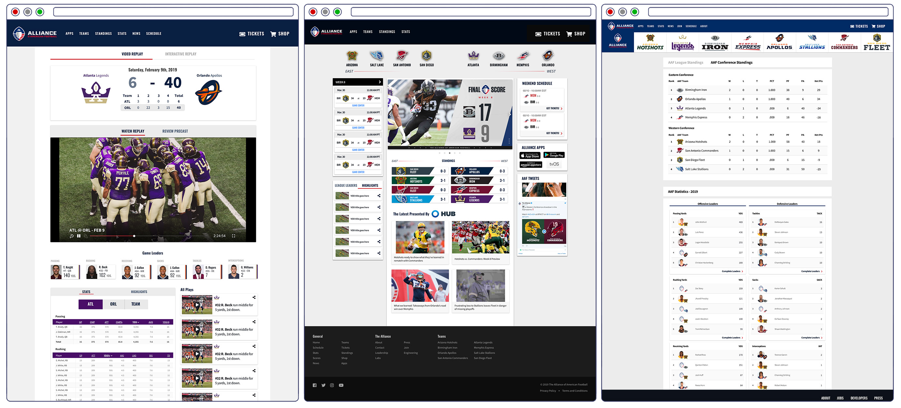

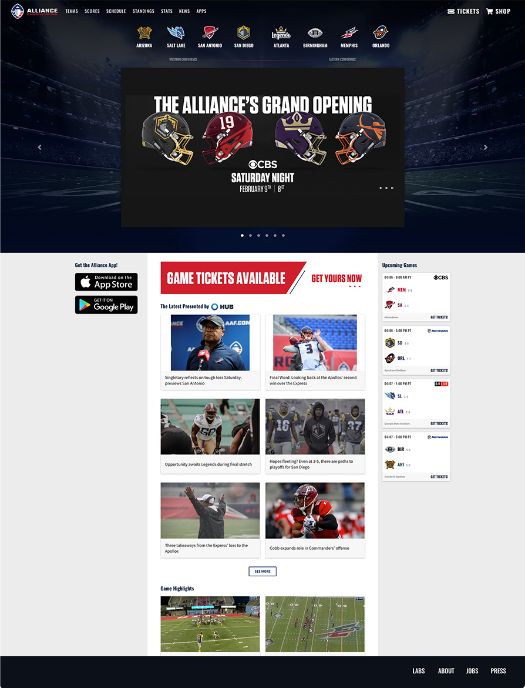

## Research

Given the tight delivery timeline of the project, I had to find the fastest approach to conduct just enough research – obtain the key insights for design execution towards the two large, but somewhat vague objectives communicated to me. 

  

    <h7>Boosting Viewership</h7>
    
Our goal was to encourage fans to watch the games on our web platform instead of traditional broadcast TV. This strategic move allowed us to build a captive audience, setting the stage for future initiatives such as introducing additional in-game features and monetization options.

  

  

    <h7>Driving Ticket Sales </h7>

    
Ticket sales constituted a crucial source of revenue for us. Given that we were in the process of establishing a dedicated fanbase for the league, our primary objective was to encourage fans to purchase tickets for upcoming games, with the expectation that this would pave the way for season pass purchases in subsequent seasons.

  

I digested prior research from the larger organization and filled in a few gaps by sitting in bars during NFL games, reading sports blogs, and speaking to my sports fanatic friends. I relied on references from existing sports platforms and looked for similarities in key areas:

> - Features and functionality
> - Information architecture
> - Visual hierarchy

## Execution

I mapped out the full user flow and created spreadsheets to detail the data from the back end. I worked with my PM to prioritize features and functionality based on:

> - User impact
> - Technical feasibility or readiness
> - Time required for implementation

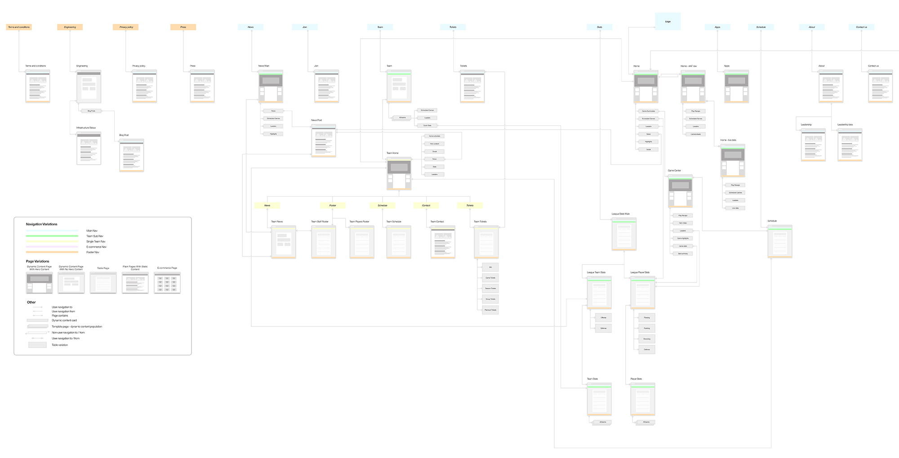

From there, a pared-down user flow with just the information architecture was given to the engineers to start building.

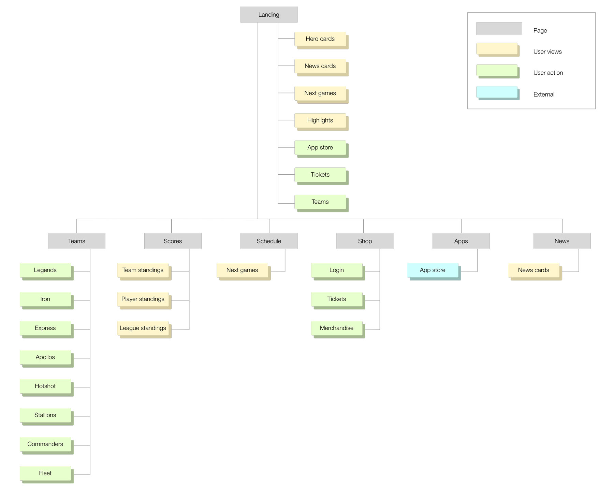

I strategized with our 2 frontend engineers on how to tackle the design system. We had to set up the foundations in the 2 quick weeks to enable ourselves to work efficiently but ensure that it was solid enough to iterate upon after meeting the major launch milestone.

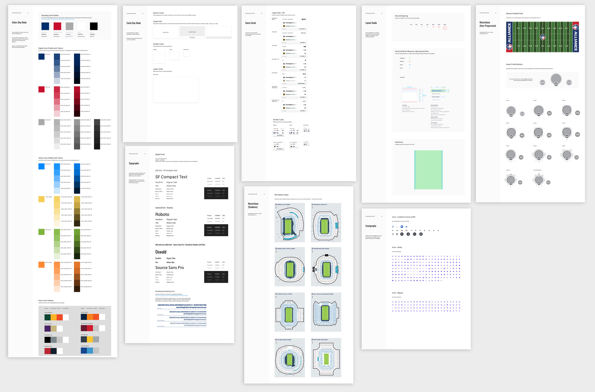

Before the new web platform went live for the first game, I set up our Google Analytics and Tag Manager with custom tags. Typically not filed under a designer’s responsibilities, but it was necessary for tracking granular user behavior.

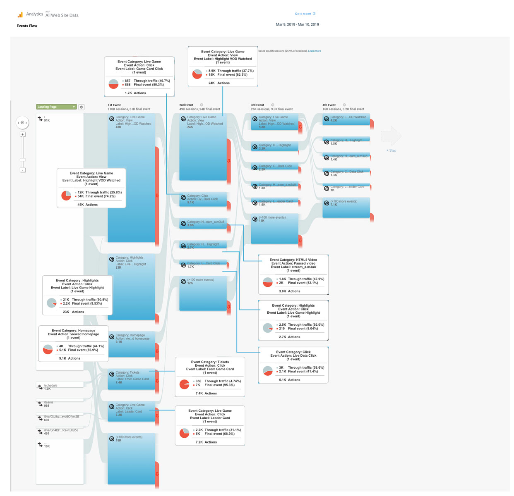

The platform went through 3 main iterations. The first iteration (left) that equally weighted the navigation for tickets and shopping was clearly obstructing the purchasing funnel. That version also buried the stats. We were all asking why we allowed the useless hero image to take up so much valuable real estate. However, because of the code structure, we had to design around that layout for the second iteration.

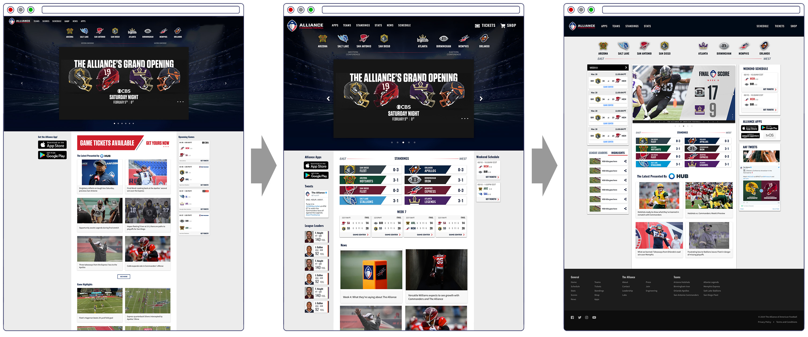

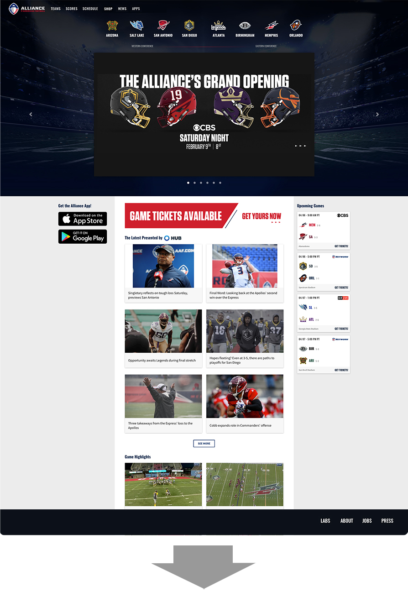

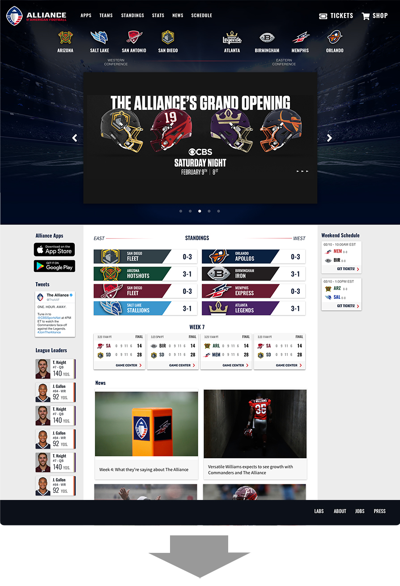

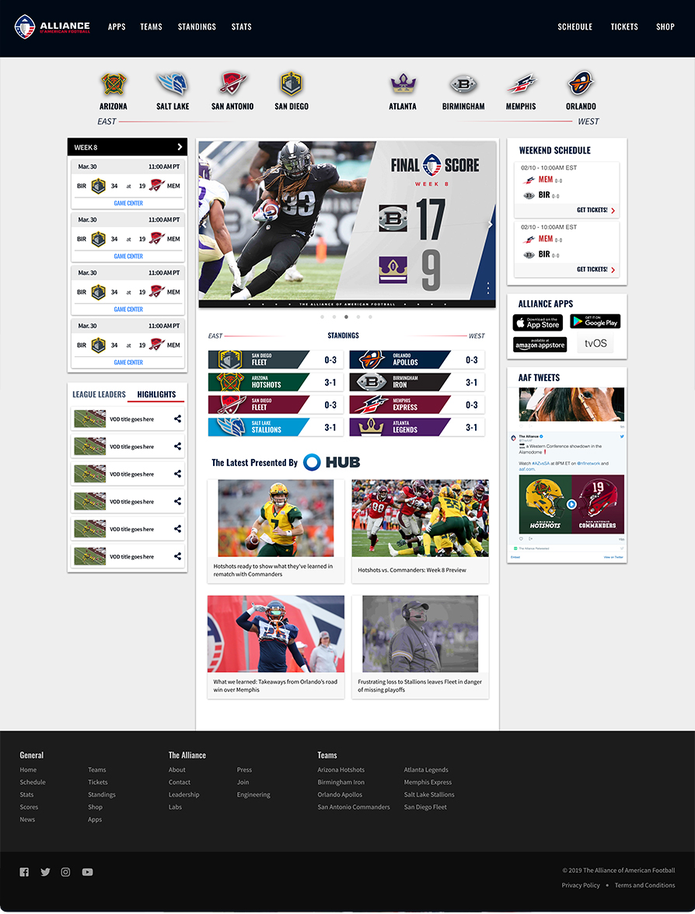

## Iterations

My product leader and I examined GA metrics week after week. 3 key insights helped my design thinking to iterate on the experience towards the platform goals.
- Users were not buying tickets for upcoming games right after watching a game. Rather, the majority of tickets were sold when users returned on their mobile device.
- The most common action preceding purchasing tickets was reviewing team standings. 
- Users that viewed team standings and highlights were 67% more likely to complete the tickets purchase flow.

We first turned our focus to mobile web. Rather than having the ticketing call-to-action as the first component after the hero image, I brought standings into the landing page and moved the CTA below that. When the 3rd insight surfaced, I converted the highlights section into a tab view with standings. 

## Results

After 3 major iterations, we saw roughly a **20% increase in ticket sales**. As for the viewership objective, we unfortunately didn't have accurate broadcast metrics to measure against. However, we were able to see an increase of viewers game after game – **8,565 in the 1st game** and reaching **22,875 by the 5th** (and last) game.

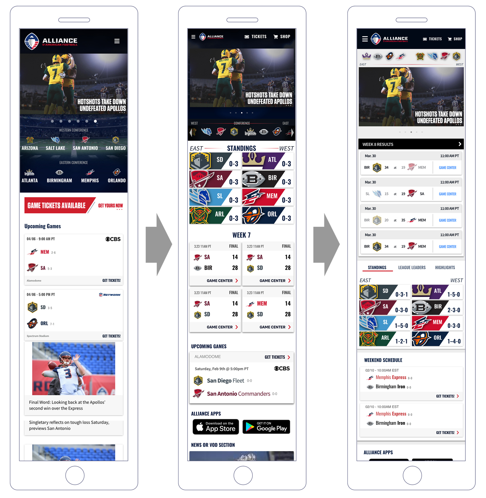

## Roadmap

In analyzing metrics from GA and mining our social media threads, we saw that our users wanted more interactivity during games. The existing gametime mode is below. Users could either view the 3D telemetry field or the video feeds. The play stats were automatically generated into a long scrolling list.

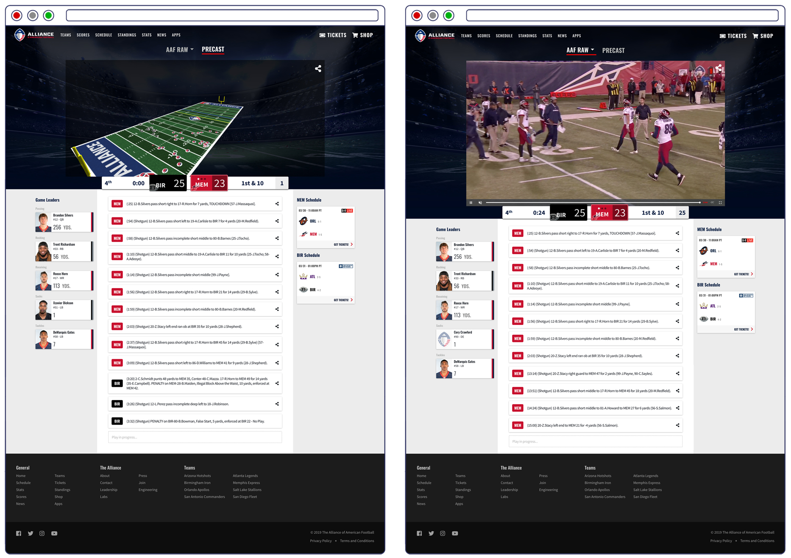

My Director of Product and I brainstormed ideas for enhancing interactivity during our downtime.

There were a large number of attempted interaction on select spots:

- Clicks on the play stat card
- Clicks on player caps on the telemetry field (We deduced this. The 3D field was built in webGL. Granular tracking was not set up.)
- Video scrubbing

Some of our ideas

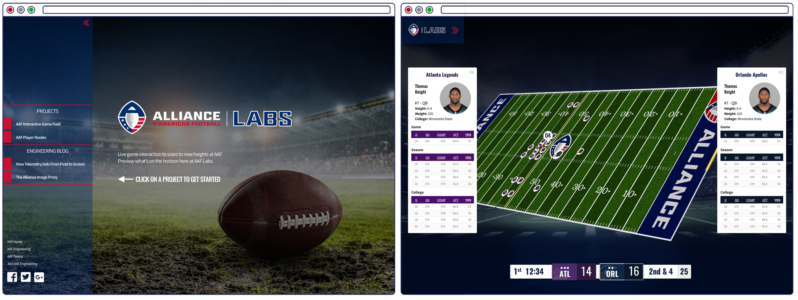

We stumbled on another interesting insight from our Google Analytics. The users that flowed through both the stats and news pages were much more likely to complete the purchase of tickets or merchandise. We hypothesized that we needed more elements to keep users delighted and spend time on the web in-between games. I sifted through our Reddit and Twitter to see if it would spark ideas (we had creative fans that posted some top-notch artwork). One question surfaced numerous times. “Why do they take the game broadcast down during the week?”

Our replay idea was born.

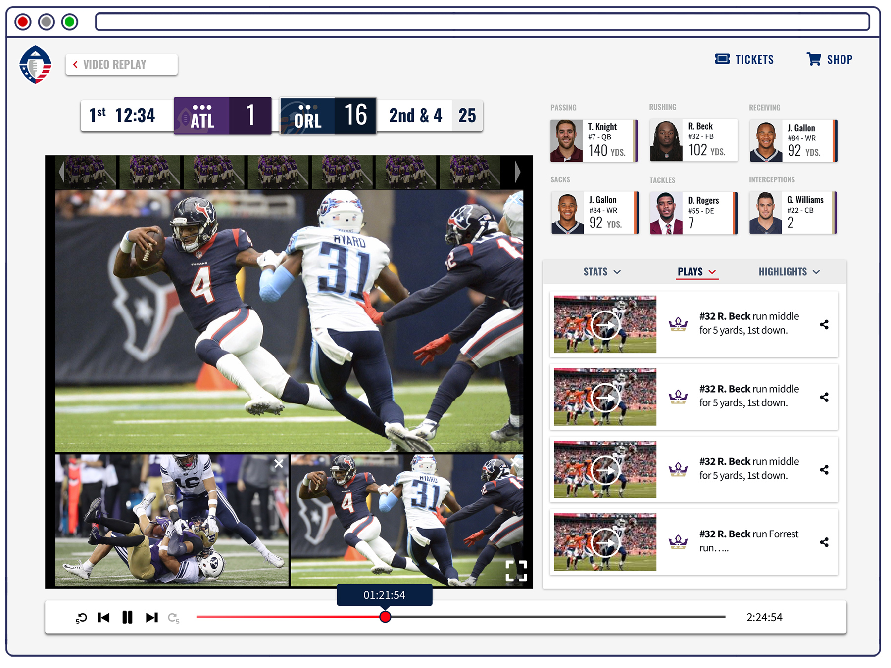

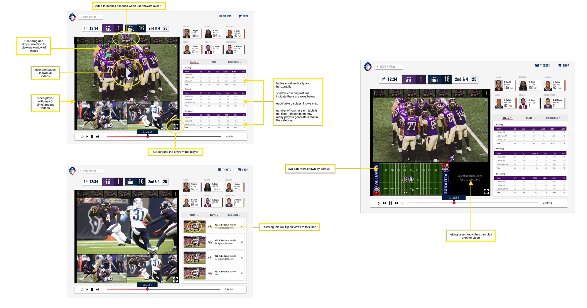

Unfortunately, we never got the chance to build these or the team operations tool. Would’ve been some fun challenges there.

---

My ad to draw fans to the web platform during gametime. Created in Photoshop:

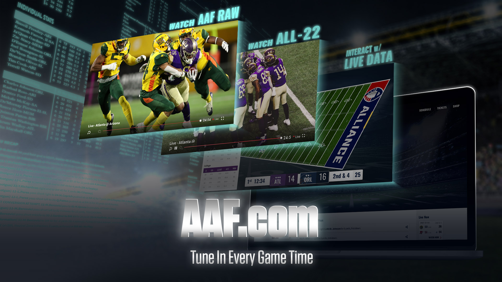

