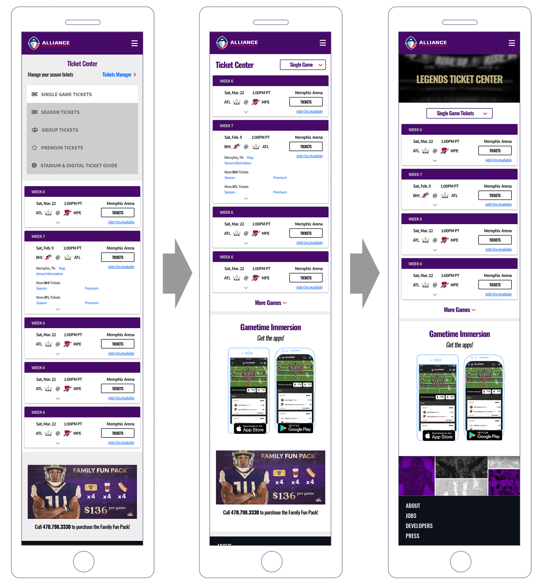

import { getImage, GatsbyImage } from 'gatsby-plugin-image';

The Alliance of American Football was a professional league founded by Charlie Ebersol and Bill Polian. The AAF began the inaugural season on February 9, 2019. The league was scheduled to have a 10-week regular season and conclude with a championship game on April 27. After eight weeks of play, however, the league's football operations were suspended by controlling owner Thomas Dundon on April 2. The league offered fans an immersive digital experience where they could interact with the game on a play-by-play level. During gametime, the web platform offered fans the ab ability to view the game from the camera of their choice as well as a digitally simulated top-down view to track each player. Between games, the web platform offered standard features such as stats for players, teams, league, standings, and allowed fans to purchase tickets and merchandise.

### The Setup

The web team was assembled 2 weeks before the kickoff of the season. I was hired to design the end-to-end experience. The interactive platform had to be built out iteratively through the season.

### Problem

The prompt was brought to me in a big, vague manner.
“We need a new web platform. Right now there’s janky WP site that only sells tickets. It needs to also sell merchandise and broadcast the game. It also needs to host some player tracking that the fans can play with during the game. Also, team ops need to use the platform for their stuff. Let’s not worry about that yet.”

My interpretation: the platform will have 2 modes, one for gametime and one in-between.

The success of the platform will be measured on

- Tickets sold per game
- Merchandise sales per week
- Average session length during games

### Research

There was not a lot of time to run a full user research process. I digested prior research from the larger organization and filled in a few gaps by sitting in bars during NFL games, reading sports blogs, and speaking to my sports fanatic friends. I relied on references from existing sports platforms on the assumption that they’ve dedicated significant efforts into user research. Looked for similarities in key areas:

- Layouts, especially the use of above-the-fold real estate
- Navigation
- Common functionality and user flows of each
- Call-to-action placement

### Execution

I mapped out the full user flow and created spreadsheets to detail the data from the back end. I worked with my PM to prioritize functionality and features based on:

- User impact
- Technical feasibility or readiness
- Time required for implementation

From there, a pared-down user flow with just the information architecture was given to the engineers to start building.

There was no time for low-fidelity. I turned my focus to high fidelity right away. I synced up with the designers on the mobile team on what I could pull from the design system and which components I should look to be adding on the web side.

Before the new web platform went live for the first game, I set up our Google Analytics and Tag Manager with custom tags. Typically not filed under a designer’s responsibilities, but it was necessary for tracking granular user behavior.

The platform went through 3 main iterations. The first iteration (left) that equally weighted the navigation for tickets and shopping was clearly obstructing the purchasing funnel. That version also buried the stats. We were all asking why we allowed the useless hero image to take up so much valuable real estate. However, because of the code structure, we had to design around that layout for the second iteration.

After the first 2 weeks of games, we noticed out traffic with the gametime data filtered out was coming largely through mobile web. We then shifted to a mobile-first design process for the in-between games mode.

### Results

From version 1 to 3, we saw roughly a 20% increase in ticket and merchandise sales. We knew there were other contributing factors – marketing initiatives, the popularity of the league growing from word-of-mouth, and fans developing allegiance with individual players or teams. For the web team, the next big push was to set up more granular tracking to find some separation so we could better measure our impact.

### Problem Addendum

In my time at AAF, I was instructed to prioritize the in-between game mode since it was a revenue driver. However, we saw that our users wanted more interactivity with the game. The existing gametime mode is below. Users could either view the 3D telemetry field or the video feeds. The play stats were automatically generated into a long scrolling list.

My Director of Product and I brainstormed ideas for enhancing interactivity during our downtime.

There were a large number of attempted interaction on select spots:

- Clicks on the play stat card
- Clicks on player caps on the telemetry field (We deduced this. The 3D field was built in webGL. Granular tracking was not set up.)
- Video scrubbing

Some of our ideas

We stumbled on another interesting insight from our Google Analytics. The users that flowed through both the stats and news pages were much more likely to complete the purchase of tickets or merchandise. We hypothesized that we needed more elements to keep users delighted and spend time on the web in-between games. I sifted through our Reddit and Twitter to see if it would spark ideas (we had creative fans that posted some top-notch artwork). One question surfaced numerous times. “Why do they take the game broadcast down during the week?”

Our replay idea was born.

Unfortunately, we never got the chance to build these or the team operations tool. Would’ve been some fun challenges there.

---

My ad to draw fans to the web platform during gametime. Created in Photoshop:

