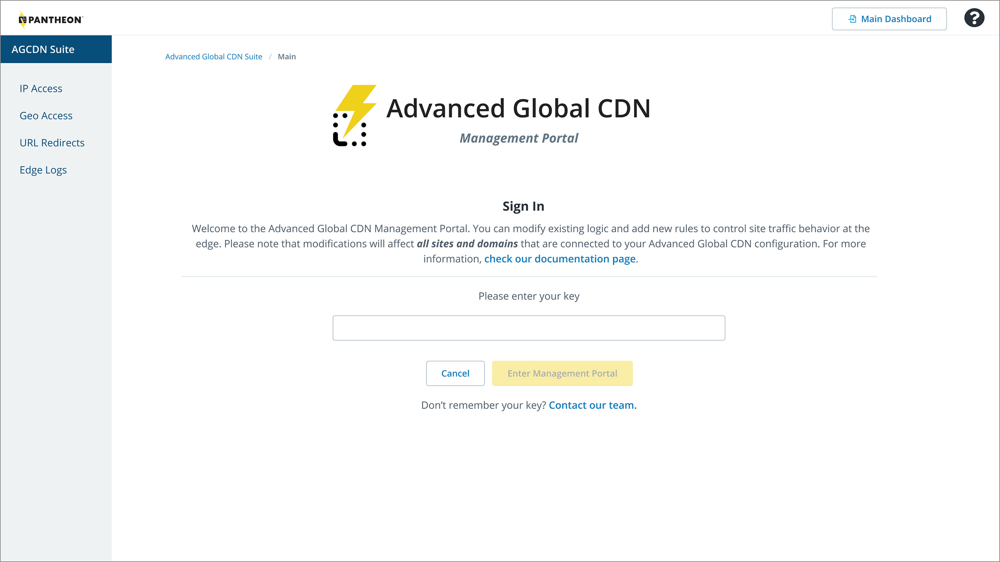
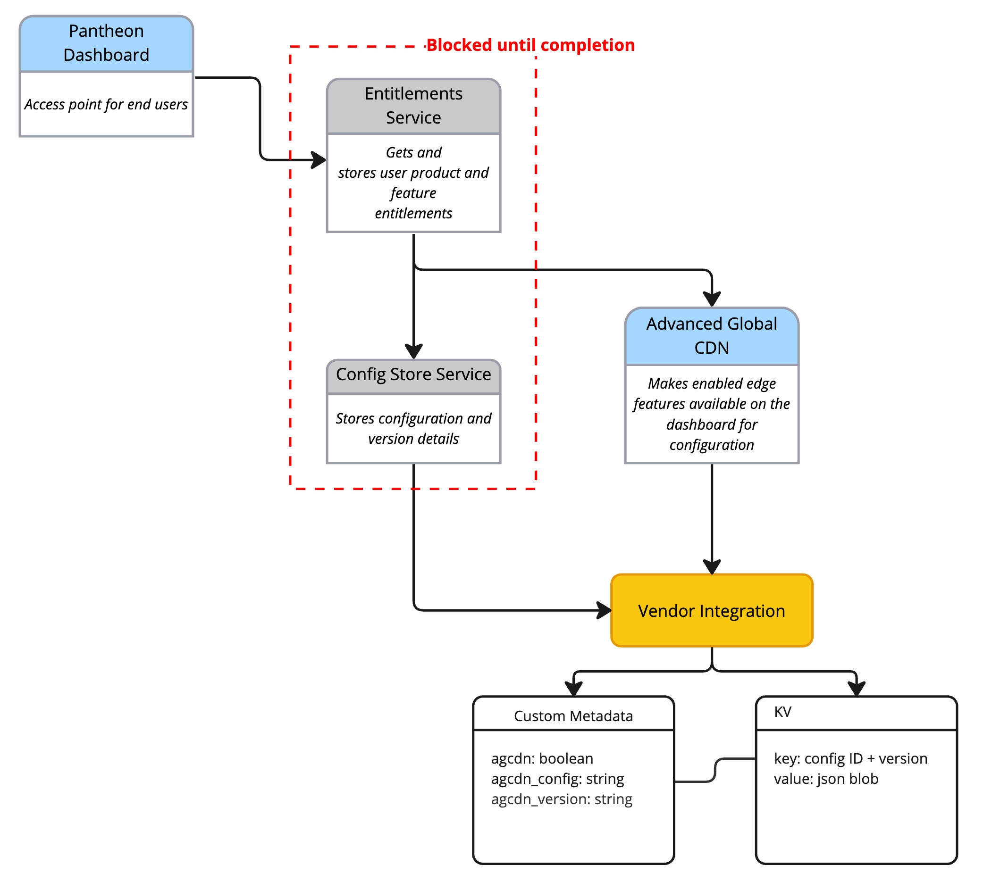
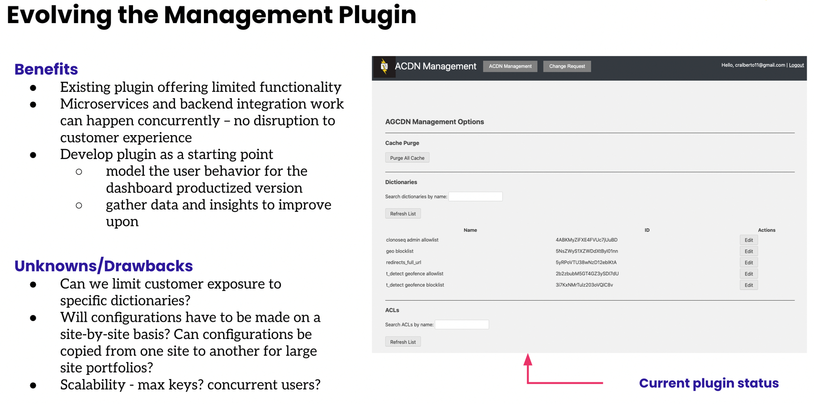
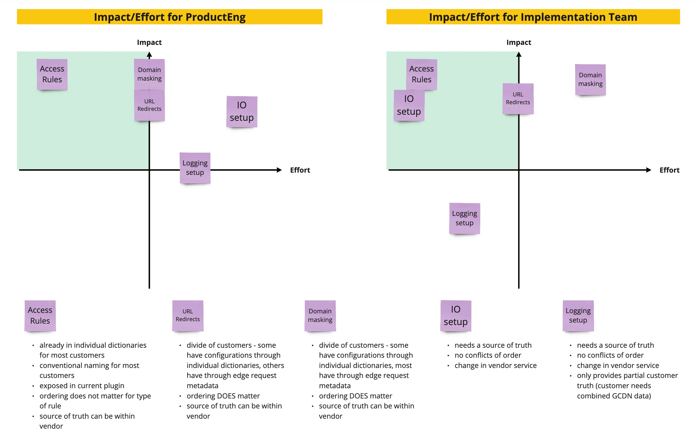
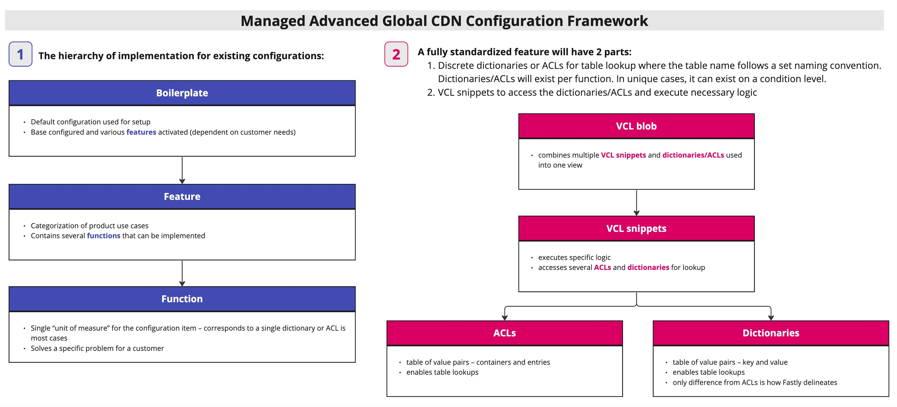
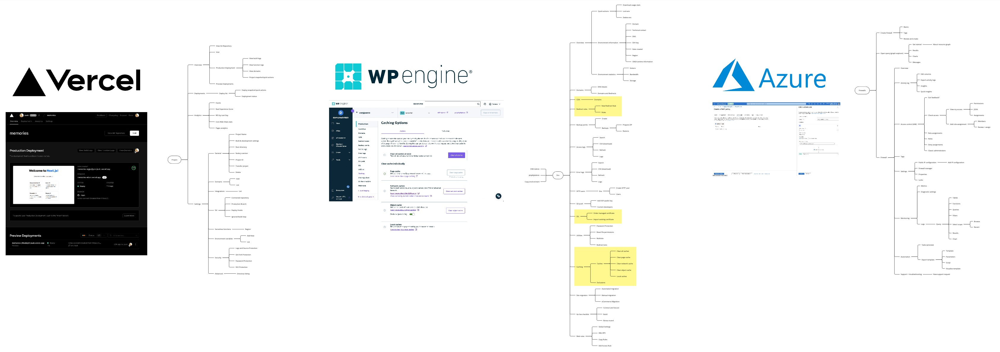
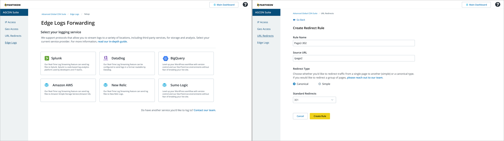

In today's digital landscape, high-traffic websites are increasingly leveraging not only content delivery networks (CDNs) but also custom logic to manipulate behavior at the edge. This plays a crucial role in enhancing website performance, security, and reliability, enabling seamless delivery to millions of daily visitors, and efficiently handling sudden spikes in traffic.

### Setup

Pantheon, the platform for managing high-performance websites, currently offers a suite of tools for customizing edge logic – Advanced Global CDN. However, this is a managed service that faced numerous operational challenges with growing support ticket backlogs. To alleviate this, we needed a short-term solution for self-service capabilities, as the platform didn't communicate with Advanced Global CDN, requiring users to rely on support tickets for changes.

### Challenge

The implementation of a self-service Advanced Global CDN through the main Pantheon dashboard presented a multifaceted challenge. Advanced Global CDN operated as an entirely separate system, rendering the platform unaware of which customers were utilizing Advanced Global CDN services. Consequently, integrating direct dashboard control for edge features proved unattainable, necessitating users to rely on support tickets for even the smallest change to their site's edge behavior.

A critical blocker in addressing this challenge was the ongoing development of a microservice by the engineering team, intended to serve as the source of truth for customers' access to different services. While this solution promised to establish the necessary connection, it was projected to require considerable time for completion, leaving us in urgent need of a shorter-term remedy to alleviate the mounting backlog of Advanced Global CDN support tickets.

### Proposal
Collaborating with the product manager and tech lead, we proposed building a WordPress/Drupal plugin to link with our CDN vendor's services to empower users to self-serve edge behavior changes. We discovered a pre-existing plugin, abandoned due to engineering resource limitations, serving as a perfect starting point.

### Evaluation
In determining the feasibility of the Advanced Global CDN Self-Service Plugin, we embarked on a meticulous evaluation process to address crucial considerations.

#### Functionality Selection
To identify the discrete functionalities to include in the plugin, we aimed to understand the features most heavily used by customers. However, we encountered limitations with the logic written in configurations stored with our CDN vendor. As a result, we first narrowed down the functionalities to those achievable using a dictionary or Access Control List (ACL) format for making the assessment of customer impact. 

This narrowed our list down to
URL redirects
- IP blocking/allowing
- Geo blocking/allowing
- Forwarding edge logs

#### Eligibility Criteria
Next, we needed to determine which customers would be eligible to leverage the plugin. We focused on customers whose configurations utilized one of the four features we could reveal within the plugin. For some customers, usage of these features existed outside the dictionary/ACL format due to being early adopters when implementations were different. To accommodate them, a standardization process was essential, converting their features into the dictionary/ACL format compatible with the plugin. Through this assessment, we identified a substantial number of existing eligible customers, with additional potential customers attainable through light standardization.

### Design Process
For the plugin's design, we adopted a pragmatic approach, acknowledging its interim nature. We conducted in-depth UX comparative analysis to identify effective patterns utilized in similar solutions. (see image below - taken from our information architecture and UI interactions examination)

Leveraging these insights, we meticulously designed and iteratively tested prototypes, receiving overwhelmingly positive feedback from users. The user responses reinforced our confidence that deploying the plugin would significantly reduce support tickets by enabling customers to efficiently self-serve through the plugin's intuitive interface.

### Scalability Challenges
As the implementation phase approached, we encountered crucial challenges regarding scalability and integration with the CDN vendor's services. Custom API keys generated for customers to access the plugin posed scalability issues, especially during simultaneous usage. We considered limiting the number of keys as a potential mitigation strategy but recognized that it would inadvertently constrain the customer impact.

Additionally, we discovered that porting control into the plugin would eliminate the version control provided by our CDN vendor, potentially leading to misconfigurations and increased support tickets. This posed a significant risk to the project's primary objective of streamlining user interactions and minimizing reliance on support for Advanced Global CDN changes.

### Decision and Way Forward
Given the identified challenges and their potential implications, we transparently presented the benefits and risks associated with the AGCDN Self-Service Plugin to our product leadership. After a comprehensive evaluation, it was determined that the risks outweighed the advantages for the proposed implementation. While not proceeding to build out the plugin, the valuable design thinking and interaction patterns developed during this project will not go to waste. Instead, they will serve as a foundational groundwork and provide a jumpstart for the future productized version, which will be seamlessly integrated into the dashboard once the two essential microservices are completed.

