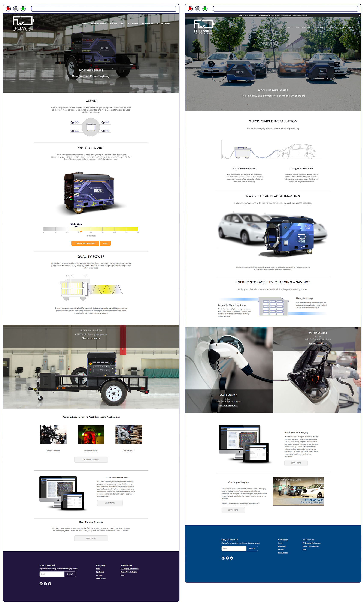
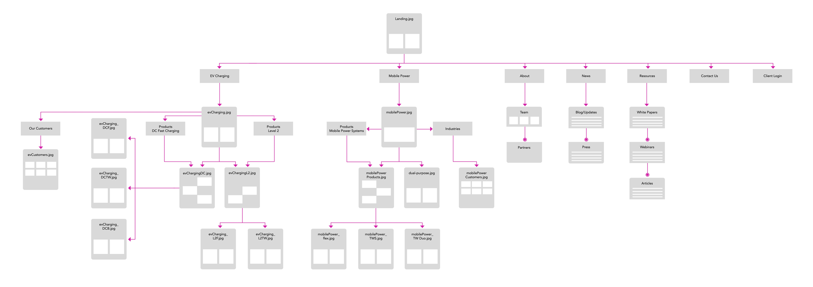
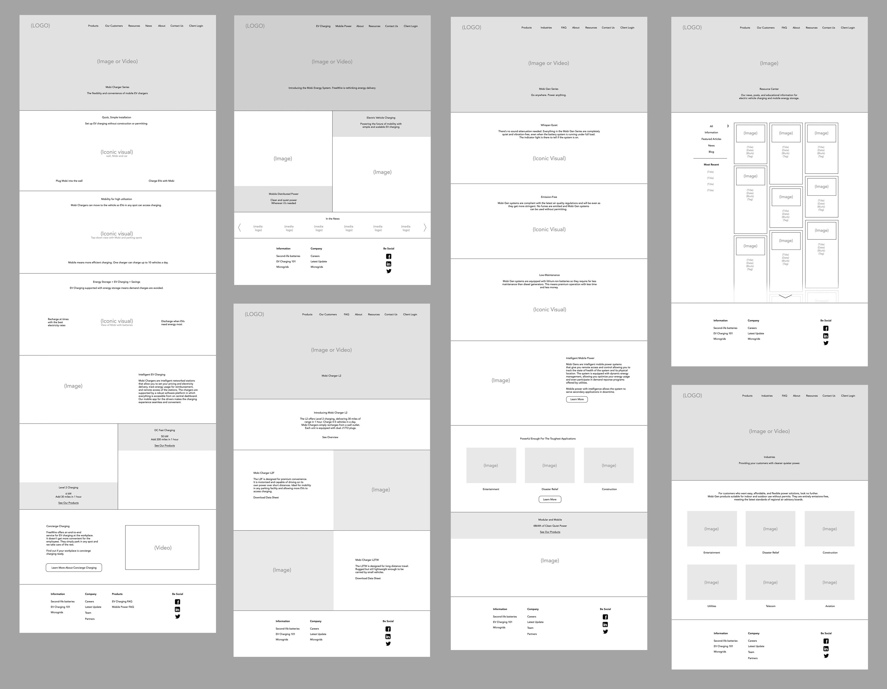
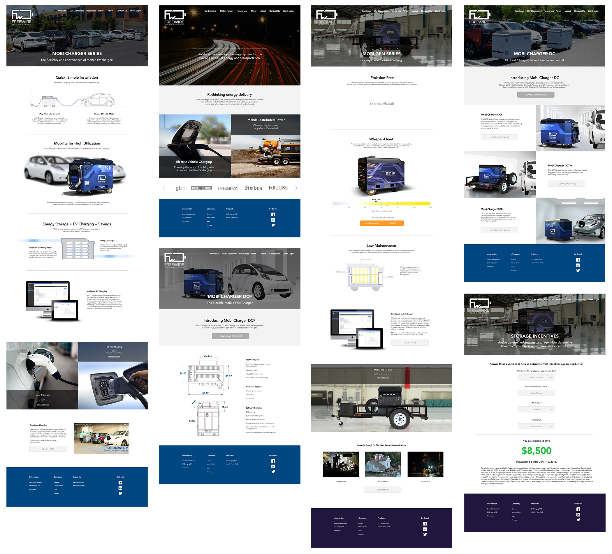
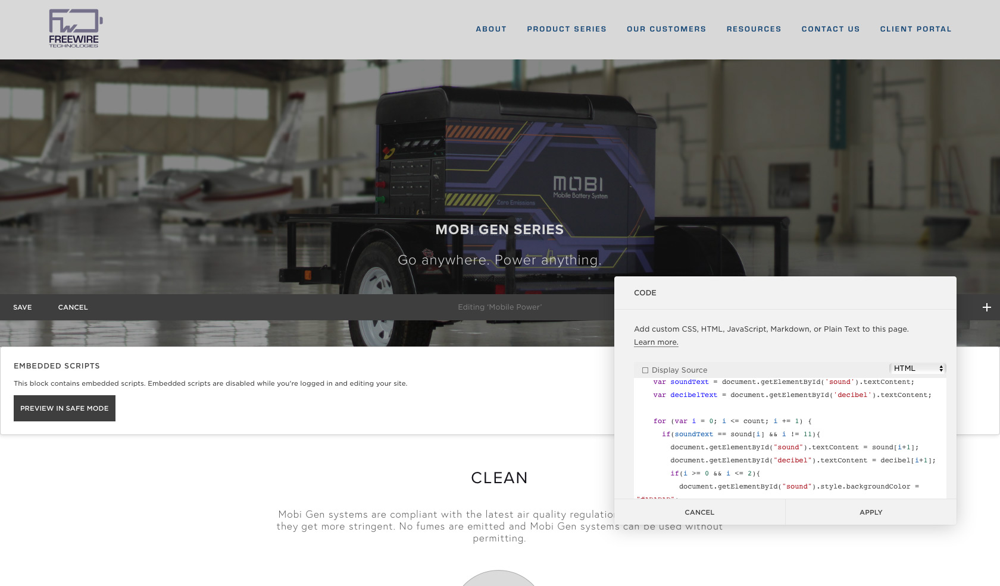
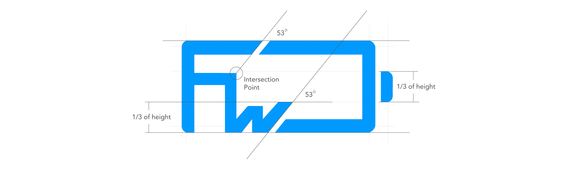
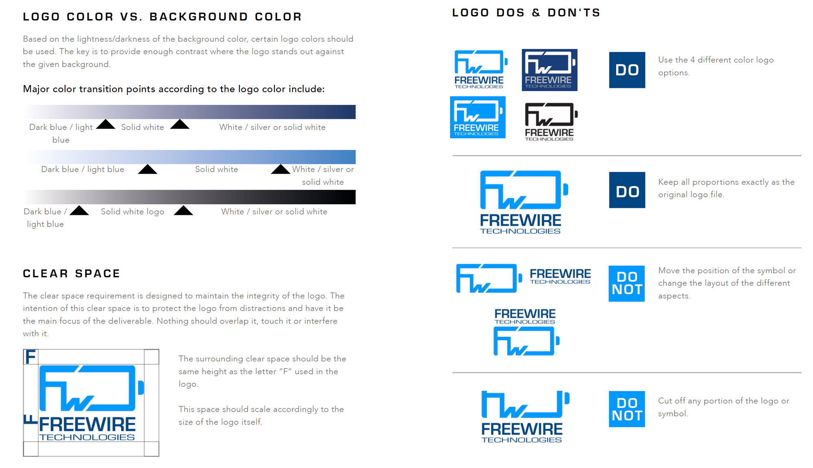
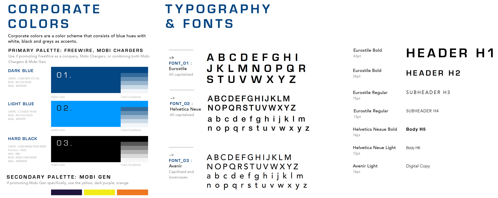
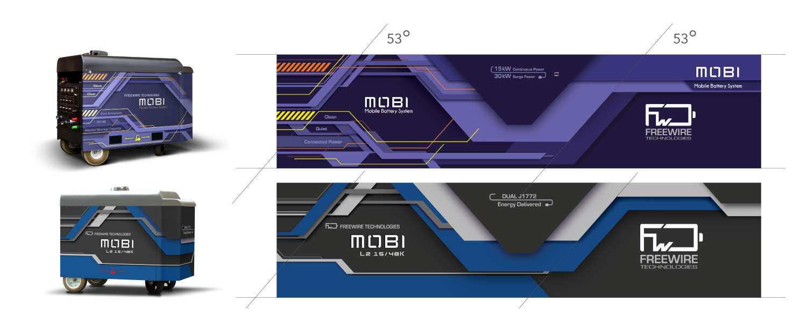
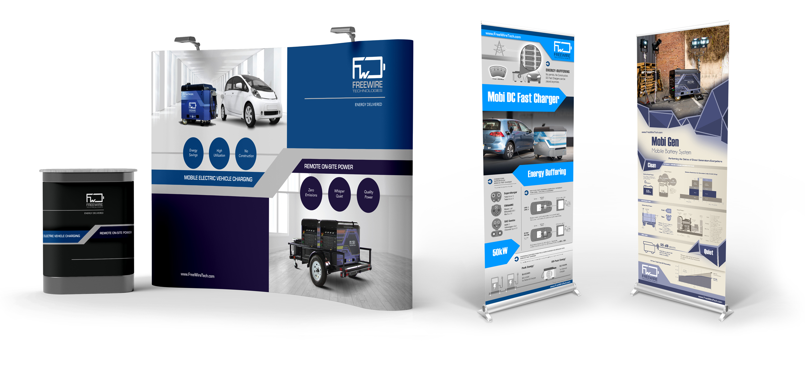

import { getImage, GatsbyImage } from 'gatsby-plugin-image';

FreeWire Technologies builds cloud-connected battery systems for on-site power and battery-backed EV charging. I designed and built the company website from 2016 to early 2019. Design and implementaion was a one-woman task for me in these early days. Process documentation helped me eventually offload the maintenance of the site to an external consultancy agency.

### Setup

The company needed a new face in the digital world. The first version of the website under-represented the capabilities of our products and did not inspire enough prospective customers to get in contact with us. The objective of a redesign was to boost the volume of customer outreach as well as the concentration of ones that fit our customer profile. We decided to rebuild from the ground up.

### Collaboration Process

Determining messaging, copy, and visitor flow was a collaborative effort between me and the co-founders. I made a few documents to assist with the process.

Site Map

Low Fidelity

High Fidelity

I created high fidelity mockups to align the team on visual look and feel.

### Development

Build time! The site was started with a website builder theme and lots custom code blocks. There were some unlinked pages that were purely hosting js scripts for a linked page on the site to access. Square Space didn't allow for vector files and it automatically ran its own compression on images so I made other unlinked pages that hosted those graphic files.

This was not an optimal way to build – I knew that. There was a lot of js overwriting each other, weighing down the site. The heavier site would degrade our site loading speed as well as other site performance stats. However, it was more important to push out a site with all the frontend interactions as determined best by the team. I tabled the site performance issue for the time being.

### Branding Work

Leading up to the work on this new version of the website, I had to get a few visual elements in place. First, we needed a new logo.

Next, we needed a new color palette and typography language.

The Mobis themselves also needed to be re-outfitted.

Finally, the stylistic choices needed to be propagated across all the marketing collateral, even print collateral.

