FreeWire Technologies builds cloud-connected battery systems for on-site power – the cleaner alternative to a traditional diesel generator. Operators control and monitor the battery system using the digital touchscreen on the back panel.

### The Setup

The Mobi Gen did not always have a digital touchscreen interface. Previously, it was s tiny LCD screen that only displayed the state of charge. The battery systems can be monitored remotely so we were able to see the lack of usage since the customers first purchased units. We suspected the cryptic screen may have something to do with it.

I led a team of 3 design consultants to tackle this challenge. The objective was clear: make it more user-friendly to ensure customer retention.

### Preparation

While the design consultants were talented and experienced, they were new to designing human-machine interfaces and to power delivery devices. I spent the 3 weeks leading up to their start date creating documentation to bring them up-to-speed on our product.

Our battery system is a clean alternative to diesel generators with similar users and customers. I needed to bring them up to speed on the industries using diesel generators and use cases within each.

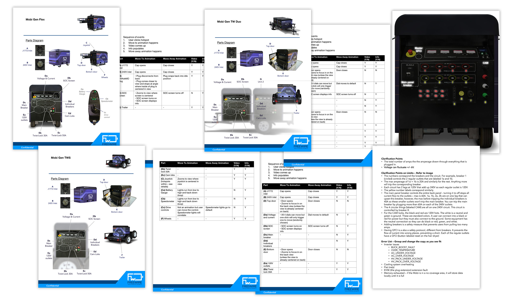

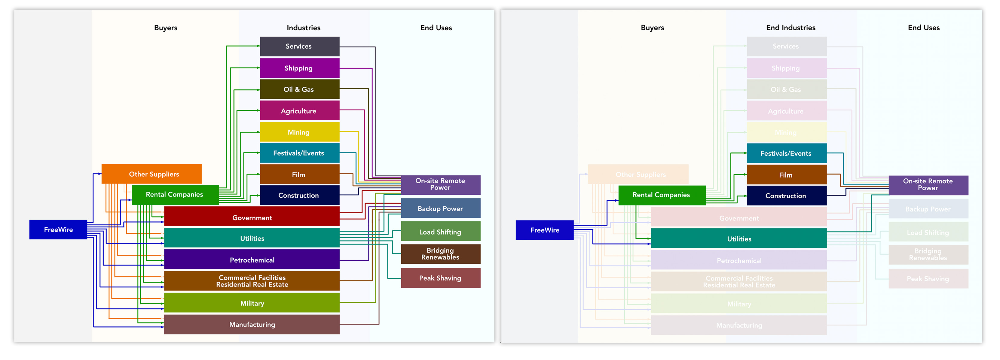

### Research

We worked as a team to dive deeper into the use cases we were serving. We contacted our customers and the operators of power delivery units. We set out on a road trip to conduct our contextual research on customer sites and in-person interviews. We followed up with surveys and questionnaires.

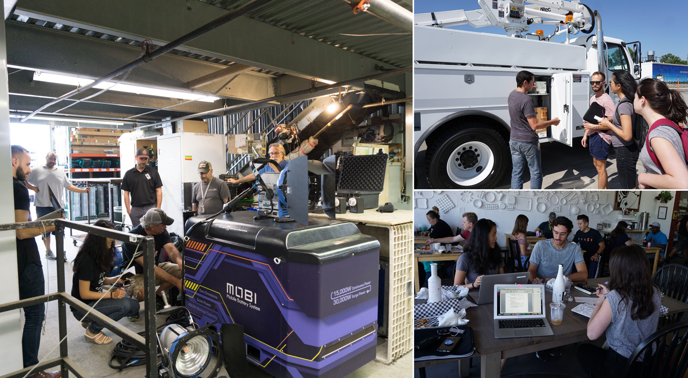

Our key insights:

- Feedback – a battery system is unfamiliar to diesel generator operators so feedback for every user interaction is critical.
- Familiarity – the closer the display can look and feel like controls/displays found on diesel generators, the better.
- Status at-a-glance – operators like to monitor the asset from afar so key information should be legible from a distance.

We synthesized our findings. I presented them to our executive team to start determining engineering bandwidth allocation.

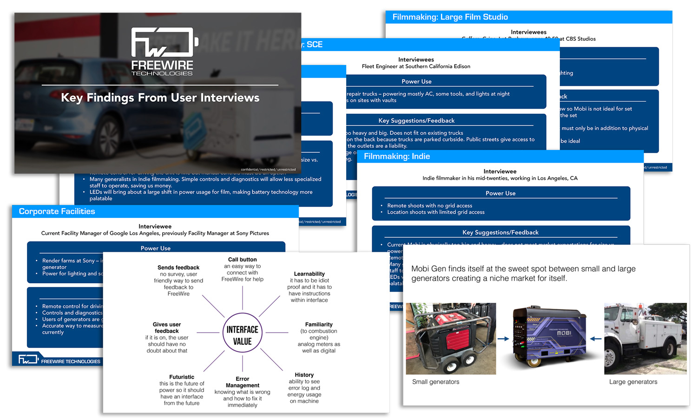

### Execution

The design consultants brainstormed over the next 2 weeks. I met with them at the end of each day to check on the progress and provide feedback.

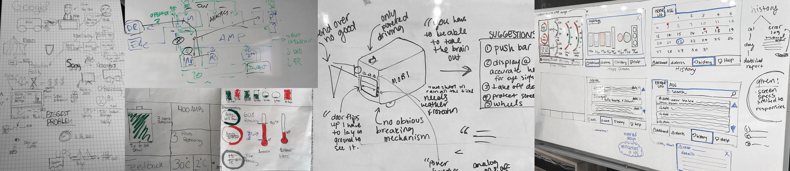

As we started to lock down the design, I created user flows and a site map for our embedded software engineers to reference.

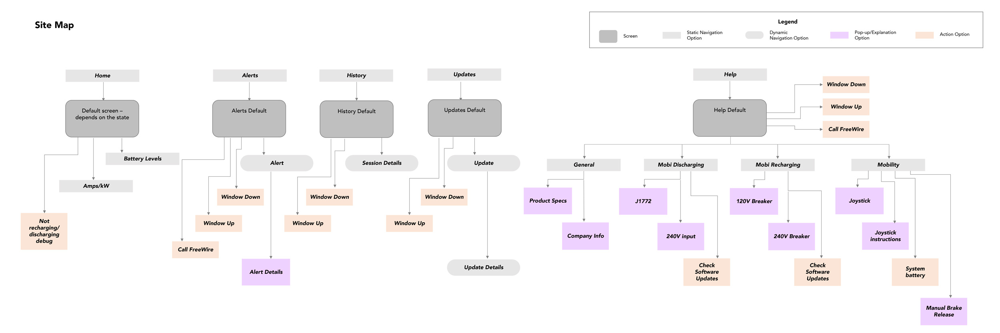

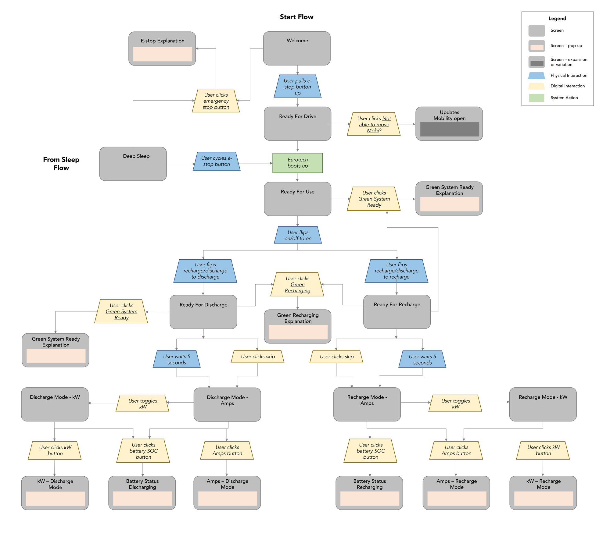

As the design consultants wrapped up their time with me, we had prepared the design for what we determined to be the ideal user interaction.

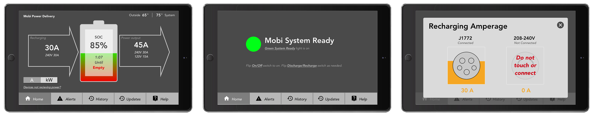

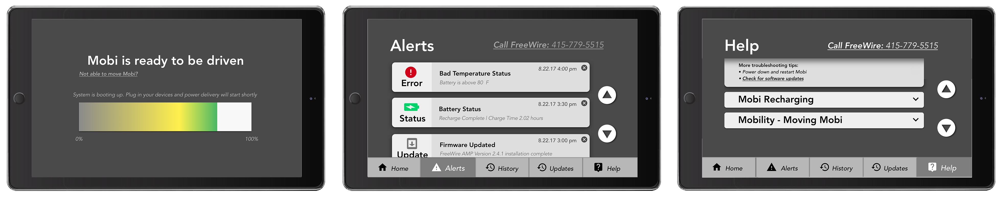

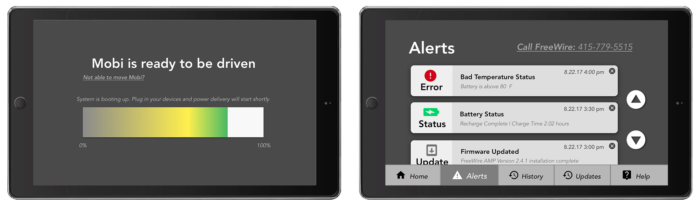

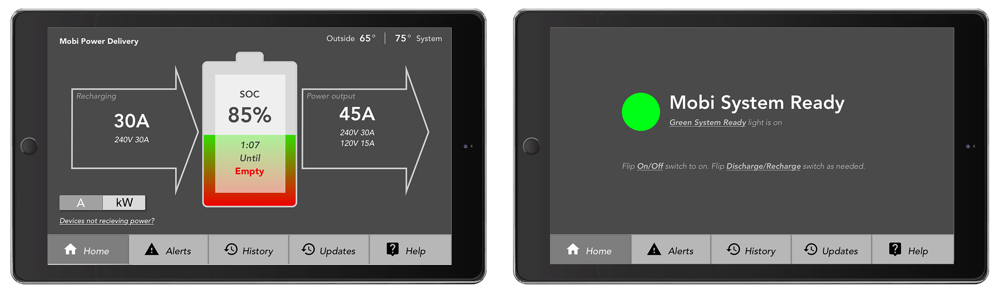

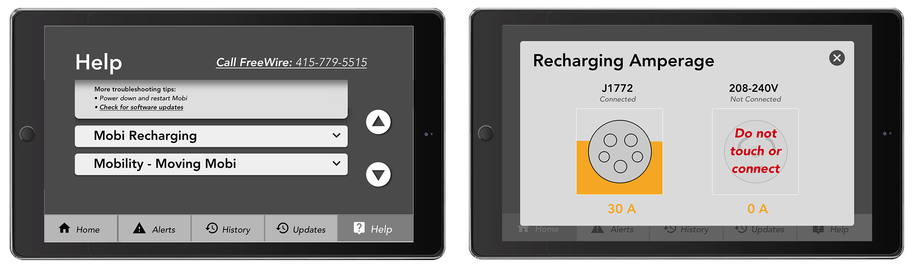

It was time to pare down the user interaction for what we could offer in the next release due to our limited engineering bandwidth. After a series of meetings with our embedded software and firmware engineers, I scoped down the site map and user flow.

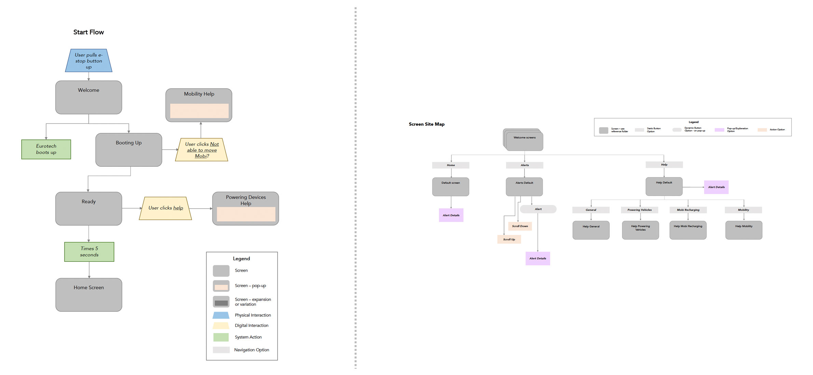

### Final Design

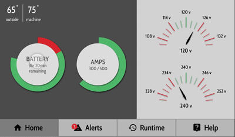

We arrived at the final back panel below. You’re probably noticing that the digital touchscreen was not the only upgrade our battery system got. The reconfiguration of the back panel outputs was a whole other project we crammed into this short window of time.

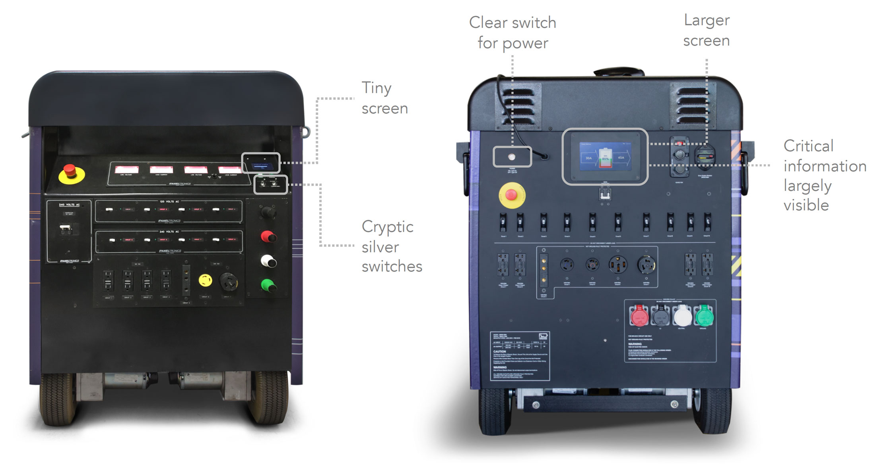

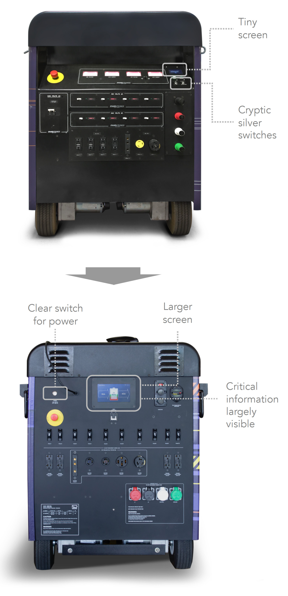

