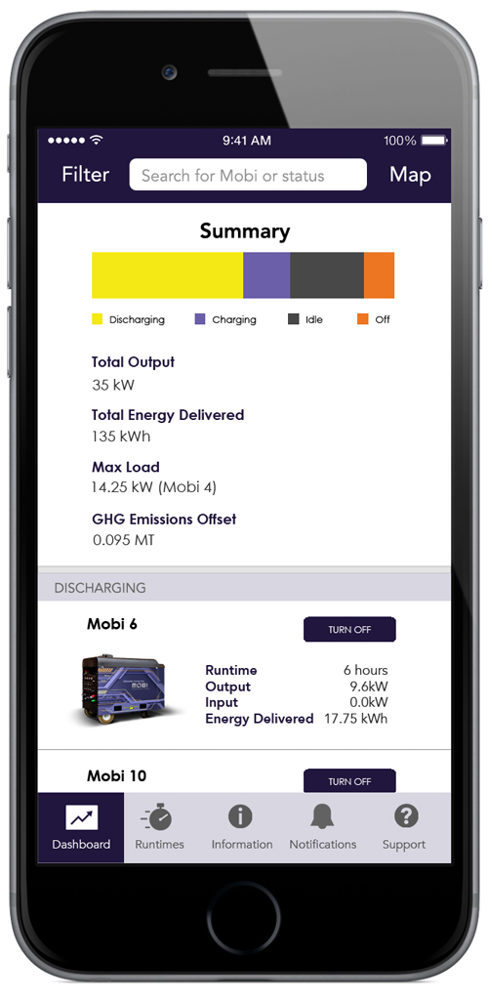
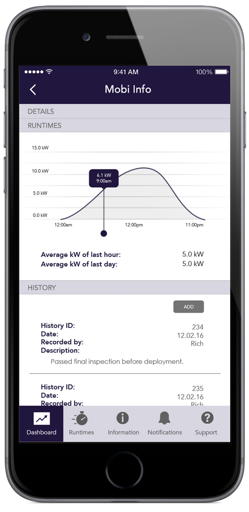

import { getImage, GatsbyImage } from 'gatsby-plugin-image';

FreeWire Technologies builds cloud-connected battery systems for on-site power – the cleaner alternative to a traditional diesel generator. AMP (Asset Management Platform) compliments the battery systems and allows for remote control and monitoring. AMP was one of 4 critical touchpoints of the Mobi Gen product experience.

### The Setup

When the power is on, everyone on the construction or event site is going about their job and no one notices. All hell breaks loose if the power does go down. For the fleet manager, an outage is simply not acceptable. They need to know the status of their fleet of power delivery units at all times and at a glance. AMP was created to do just that. Managers can geo-track units, view individual unit operating details, and remotely control the functions of each unit deployed in the field.

### Business Case

A construction site is the most obvious place to find diesel generators, but they are actually used on sites in almost every industry. The first step was to understand how the usage differs across each industry. We needed to determine how the Mobi Gen fits into each and which use cases we wanted to serve. We analyzed setup logistics, power requirements, ease of recharging, and a host of other factors.

We created many living documents for reference by the product team and to deliver the insights to the rest of the company. I created presentations of diagrams, charts, and fully illustrated user stories of select hypothetical scenarios.

### Persona Analysis

After the high-level examination of the use cases, we honed in on the key questions that would guide the design of the platform.

- What personas would be using the platform and with what frequency?
- What data is important to each of them?
- How detailed should the data be?
- What are their objectives and what order should the data be displayed to help them accomplish those quickly?

It was time to bring in the viewpoint from the firmware engineers.

- What data we can offer?
- How close to real-time can we display each piece?

We put together a spreadsheet of available values, lag time, and conditions to consider. We also diagrammed the architecture of the battery system and the state machine so I could get a better understanding of potential faults in the data collection.

### User Flow Iteration

I created wireframes and clickable prototypes. I did a series of user testing and iterated on the user flow. The development of the app was to be done by our trusted offshore team. I packaged up the user flow, a styling guide, and a pdf summarizing our findings on user personas and use case scenarios.

We iterated numerous times – analyzing the task flow for each iteration, we identified key opportunities for the operators to meet their main objectives.

After:

### Final Design

We considered building just web and web responsive (startups have to keep close tabs on their burn) but there were tradeoffs we couldn’t make. Having the ability to receive real-time alerts in the case of power emergencies made native mobile a critical feature.

Thanks for reading this long story :)
