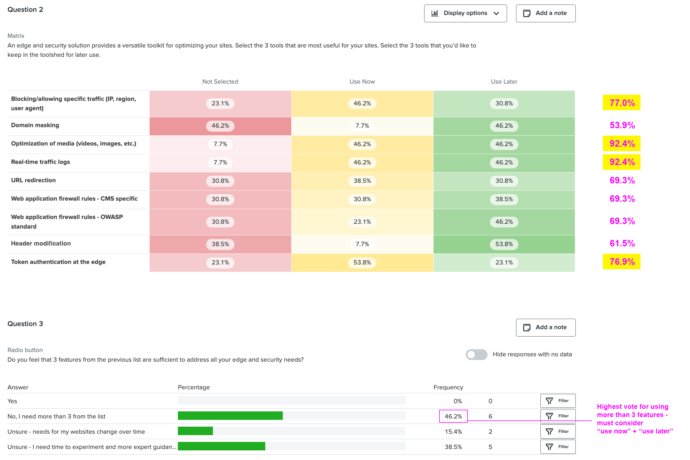
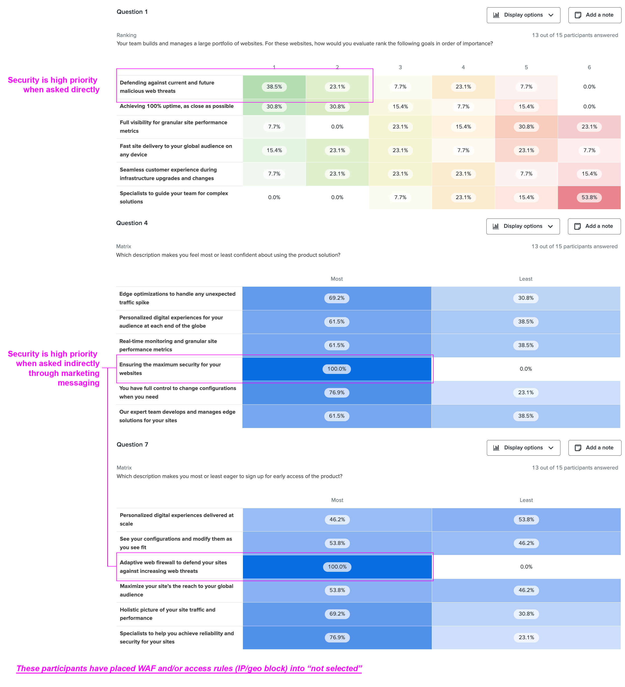

import { getImage, GatsbyImage } from 'gatsby-plugin-image';

In today's digital landscape, high-traffic websites are increasingly leveraging not only content delivery networks (CDNs) but also custom edge logic. This plays a crucial role in enhancing website performance, security, and reliability, enabling seamless delivery to millions of daily visitors, and efficiently handling sudden spikes in traffic.
Pantheon, a platform for managing high-performance websites, currently offers a suite of tools for customizing edge logic. 

However, this is all behind a curtain as it is a fully-managed service. The rendering above is from the self-service product we're moving towards. The current managed solution poses several significant issues.

**Business perspective**

- High operational costs and inefficiencies from high-touch operations with manual components.
- Inefficient communication. Without a point of reference, customers struggled to articulate their objectives clearly, leading to ambiguity in their requests and required additional conversations. 

**Customer perspective**
- Long lead-times. Every time customers needed to make changes, they were required to submit a ticket, leading to a time-consuming and resource-intensive process.
- No visibility. The lack of transparency created inconvenience and made it challenging for customers to understand the impact and value of their requested changes.

The tech lead, product leader, and I went to work to realize the vision of turning the fully-managed service into self-service product.

### Research - Priority Features

Starting off the design process, we needed to prioritize the features to deliver. 
> **What is the optimal combination of initial features that would effectively address our customers' needs?**

To identify the most suitable initial features for our self-service product, I considered various research approaches. While conducting an audit of our customers' existing edge configurations seemed like the choice to yield irrefutable results, we simply did not have the resources. The bespoke nature of the fully-managed service had resulted in diverse configurations across all our customers.Conducting a comprehensive audit would require significant effort and resources from our already stretched edge implementation team.
Recognizing the need for an alternative research method, I engaged in discussions with our team of edge implementation specialists and discovered that they maintained a record to track the usage of individual features. It was not an immutable source of truth but provided a great strating point. I also discovered that each specialist had an exceptional memory of the customers they had helped implement. Leveraging this insight, I devised a survey to capture their collective knowledge and insights. Each participant received a questionnaire in which they were presented with a product offering edge features. I then asked them to choose which tools they needed immediately, needed later, or not at all to serve their customer requests. By consolidating the results, I was able to create likely combinations of features and test their viability. To supplement the information from the internal surveys, I screened for edge developers from the world wide web and conducted a similar study.

There were some discrepancies. For example, domain masking was a highly desired feature to our internal implementation experts but most participants didn’t not select it for any use at all. I had to figure out how to weigh the 2 survey results – err towards the internal experts or external participants. 

> **Customers often do not know what they need – they will send a request for a simple redirect when they actually need some complex domain masking. It’s often up to us to decipher and translate their requests.**

I wanted to capture more evidence to add more color on this matter for my team. I ran one more quick survey with the same group of external participants – a conjoint analysis that would surface the customer intent versus their intended implementation. 

Indeed it was just as our implementation experts described it – customers are very clear on their desired performance outcomes but would then conflate and misunderstand the features that would help them achieve such outcomes. It was then confidently decided that the features to be offered as part of the initial product release would weigh heavily towards the recommendations of our internal experts.  

### Architectural Decisions
As we proceeded towards execution, we needed to lock down key architectural decisions. 
> **How do we structure the relationship between our platform entities and edge entities?**
I took a two-pronged in my research effort – a series of interviews with customers and a revealing workshop with our edge implementation team. In the workshop, I presented simulated customer scenarios ready for implementation and ask them to relate the entities accordingly.

The initial interviews with select customers confirmed their preference for individual site-level control of edge logic, which aligned with their immediate needs. However, interviews and the workshop with the edge implementation team revealed otherwise.
They unveiled a more complex landscape – the preferred configuration involved a combination of governing multiple sites with a single edge configuration, while still allowing each site to have multiple configurations. I collaborated with my tech lead to assess this structural feasibility and other options. We weighed the pros and cons of each architectural structure

and explore the IA stemming from each

After careful consideration, we landed on an option that was initially straightforward but provided the flexibility for building into the more advanced structure later in the product roadmap. We made the decision to have edge configurations controlling multiple sites but each site can only be connected to one configuration.

### Co-Design Workshops

Following the results of the initial investigative sessions, it was time to delve into the user experience design. I facilitated a series of co-design sessions involving cross-functional teams – sales engineering, product engineering, and the edge implementation team. These sessions aimed to achieve a full 360-degree view of the product from perceived value to actual value delivery. I organized two sessions with the larger group of 15 participants, fostering collaborative discussions through hands-on exercises. 
It was during these sessions that we had a significant realization Self-serviceable tools for changing web traffic behavior gave customers great power but also entails great risk. A site could go down entirely due to the unintended sequencing of edge rules. It was paramount to give customers a testing ground to instill confidence – a way to test, break, and fix stuff. This was the value proposition that would uniquely differentiate our offering. We designed the user experience around this value proposition.

I continued with roughly 7 deeper co-design sessions that included one key sales engineer, implementation specialist, and the tech lead from our edge engineering team (lost count of session numbers). The flexibility and spontaneous nature of these sessions allowed for deeper exploration and generated breakthrough ideas that honed in on the optimal product experience.

### Design Process

I iterated on the designs in low fidelity, maintaining nearly daily check-ins with my product leader and tech lead for feedback to ensure alignment. At this point, we also began to test with customers and external participants.

We moved into mid-fidelity prototyping to increase the frequency of the feedback loops. These mid-fidelity prototypes wer identifiable as our Pantheon dashboard, striking a balance between similarity and mid-fidelity design. By omitting colors and other embellishments, to ensured that the focus remained on the functionality and core features of the product.

During prototype testing, participants were asked to complete a series of tasks and we documented their success, points of friction, and any open feedback they gave through out the process. 

### Results
I distilled the results from the final prototype testing into a comprehensive report to inform my immediate team and cross-functional partners. Nobody likes long slide decks so I strategically crafted a slide deck that peeled back like an onion (or a good Twitter thread). The first section of just 8 slides covered the key insights, respective details and recommendations, and a quick context of the research methodology.

Respective details and recommendations + quick context of the research methodology: 

### Supporting Details

For anyone with the bandwidth to dive in, the details of the study were pulled into the appendix of 17 slides. I wanted to be transparent that our team was fishing for invalidation or validation for specific hypotheses and a plan of action for each:

I also wanted to shed light on feedback and insights given by individual customers and provide visibility into the customer participant recruitment process – enable teammates reviewing my report to better qualify the feedback and insights.

And finally, I closed the appendix with a hierarchy chart of documentation on this work for all my cross-functional partners to navigate to the ones they needed to progress their part.

Thank you for reading this super long case study.