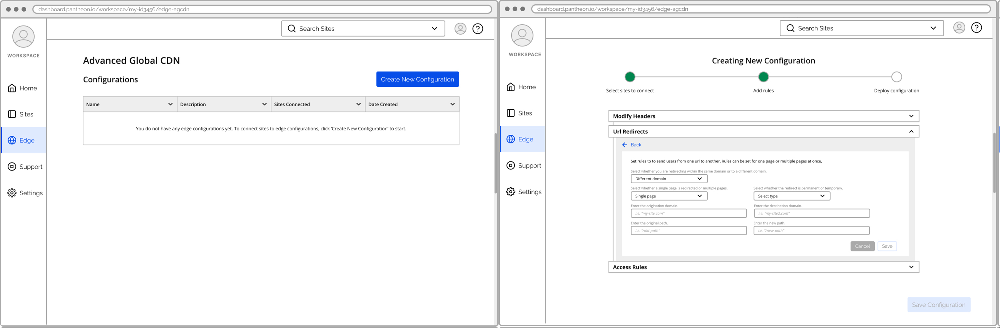

In today's digital landscape, high-traffic websites are increasingly leveraging not only content delivery networks (CDNs) but also custom edge logic. This plays a crucial role in enhancing website performance, security, and reliability, enabling seamless delivery to millions of daily visitors, and efficiently handling sudden spikes in traffic.
Pantheon, a platform for managing high-performance websites, currently offers a suite of tools for customizing edge logic. 

However, this is all behind a curtain as it is a fully-managed service. The rendering above is the intended direction we're headed. The current managed solution poses several significant issues:
Business perspective

- High operational costs and inefficiencies from the required heavy manual intervention.
- Inefficient communication. Often, customers struggled to articulate their objectives clearly, leading to ambiguity and confusion in their requests. Consequently, our implementation specialists faced significant challenges in deciphering the overall objectives of the customers and developing tailored solutions. This lack of clarity not only consumed additional time and effort but also caused frustration for both our specialists and the customers. The inefficiency in understanding the customers' intent further amplified the problem, resulting in prolonged development cycles and suboptimal solutions.
  Customer perspective
- Long lead-times. Every time customers needed to make changes, they were required to submit a ticket, leading to a time-consuming and resource-intensive process.
- No visibility. The lack of transparency created inconvenience and made it challenging for customers to understand the impact and value of their requested changes.
  The tech lead, product manager, and I went to work to realize the vision of turning the fully-managed service into self-service product.

### Research for Key Decisions

Starting off the design process, two critical decisions needed to be made that would shape the direction of the rest of the product:

- Initial Features: We needed to determine the optimal combination of initial features that would effectively address 60-80% of our customers' needs.
- Edge Configuration to Site Relationship: We had to decide whether edge logic should be controlled on a site-by-site basis or if a more holistic approach should govern multiple sites.

To identify the most suitable initial features for our self-service product, I carefully considered various research approaches. Initially, conducting an audit of our customers' existing edge configurations seemed like the obvious choice. However, upon closer examination, it became clear that this approach would be an incredibly resource-intensive endeavor. The bespoke nature of the fully-managed service had resulted in diverse configurations, making it challenging to standardize and time-consuming to obtain the data to analyze. Conducting a comprehensive audit would require significant effort and resources from our already stretched edge implementation team.
Recognizing the need for an alternative research method, I engaged in discussions with our team of edge implementation specialists. Despite the lack of an official immutable source of truth for customer feature usage, I discovered that each specialist had an exceptional memory of the customers they had helped implement. Leveraging this valuable insight, I devised a survey to capture their collective knowledge and insights. By consolidating the results, I was able to create likely combinations of features and test their viability.
To supplement the information from the internal surveys, I screened for edge developers from the world wide web and conducted a study. Each participant received a questionnaire in which they were presented with a product offering edge features. I then asked them to choose which tools they needed immediately, needed later, or not at all.

The combined research approach provided valuable insights actionable enough to determine the combination of features that would most satisfy customer needs.

In order to determine the optimal edge configuration to site relationship, I engaged in a research process of gathering insights through interviews with both customers and members of the edge implementation team.

The initial interviews with select customers confirmed their preference for individual site-level control of edge logic, which aligned with their immediate needs. However, I intuited that this approach might not be the most optimal solution for our product.
In light of this, I conducted another round of interviews, this time with specific members of the edge implementation team. I tailored the questions to uncover their approach in setting up customer configurations and concluded with a direct inquiry into their preferred edge configuration to site relationship. The results were more nuanced than anticipated.
The interviews unveiled a more complex landscape. It became apparent that the preferred configuration involved a combination of governing multiple sites with a single edge configuration, while still allowing each site to have multiple configurations. Recognizing the technical and user experience complexities associated with this approach, I collaborated with my tech lead to assess its feasibility.

After careful consideration, we determined that implementing this configuration would be excessively intricate both in terms of technical execution and designing a user-friendly product experience. Instead, we decided to prioritize a more straightforward approach initially, with the vision of eventually realizing the advanced configuration for customers willing to pay a premium. To accommodate this future state, we made the decision to have edge configurations controlling multiple sites and a site has one configuration.

### Co-Design Workshops

With the groundwork laid and key decisions made, it was time to delve into the user experience design of the self-service product. To gain a deeper understanding of the implementation process, I conducted investigative sessions with several members of the edge implementation team. Through these sessions, I presented them with hypothetical customer requests, carefully observing and documenting their implementation approaches. This formed the basis for further design exploration.
Following the investigative sessions, I sought a comprehensive perspective. I facilitated a series of co-design sessions involving cross-functional teams – sales engineering, edge engineering, and implementation team. These sessions aimed to achieve a full 360-degree view of the product from perceived value to actual value delivery. I organized two sessions with the larger group of 15 participants, fostering collaborative discussions through hands-on exercises.
It was during these sessions that we had a significant realization – customers required more than just a self-service solution for these complex edge features. Recognizing the potential risks, such as a site going down due to improper edge implementation, we saw the importance of providing customers with a testing ground – a mechanism to instill confidence and assurance in their implementations.

Taking that key insight and many others, I continued with 4-7 co-design sessions that included one key sales engineer, implementation specialist, and the tech lead from our edge engineering team. The flexibility and spontaneous nature of these sessions allowed for deeper exploration and generated breakthrough ideas that honed in on the optimal product experience.

### Design Process

I iterated on the designs in low fidelity, maintaining nearly daily check-ins with my product manager and tech lead for feedback to ensure alignment.

We successfully reached the targeted milestone of creating a full prototype to validate our product concept. The prototype was identifiable as our Pantheon dashboard, striking a balance between similarity and mid-fidelity design. By omitting colors and other embellishments, to ensured that the focus remained on the functionality and core features of the product.

### Concept Validation

It was time to validate the MVP product concept with customers. The prototype was tested with selected customers and external participants that closely resembled our customers. The participants were asked to complete a series of tasks and we documented their success, points of friction, and any open feedback they gave through out the process. I distilled the results into a comprehensive report to inform my team and cross-functional partners. Nobody likes long slide decks so I strategically crafted a slide deck that peeled back like an onion (or a good Twitter thread). The first section of just 8 slides covered the key insights, respective details and recommendations, and a quick context of the research methodology.

### Results

Respective details and recommendations + quick context of the research methodology: 

### Supporting Details

For anyone with the bandwidth to dive in, the details of the study were pulled into the appendix of 17 slides. I wanted to be transparent that our team was fishing for invalidation or validation for specific hypotheses and a plan of action for each:

I also wanted to shed light on feedback and insights given by individual customers and provide visibility into the customer participant recruitment process – enable teammates reviewing my report to better qualify the feedback and insights.

And finally, I closed the appendix with a hierarchy chart of documentation on this work for all my cross-functional partners to navigate to the ones they needed to progress their part.

Thank you for reading this super long case study.