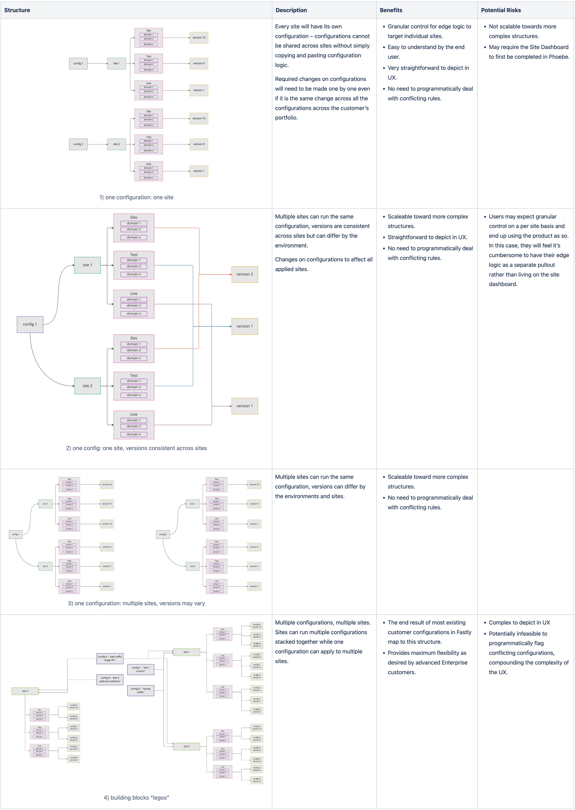

import { getImage, GatsbyImage } from 'gatsby-plugin-image';

### The Setup

In today's digital landscape, high-traffic websites are increasingly leveraging not only content delivery networks (CDNs) but also custom edge logic. This plays a crucial role in enhancing website performance, security, and reliability, enabling seamless delivery to millions of daily visitors, and efficiently handling sudden spikes in traffic.
Pantheon, a platform for managing high-performance websites, currently offers a suite of tools for customizing edge logic. 

However, this is all behind a curtain as it is a fully-managed service. The demo above is from the self-service product we're moving towards. The current managed solution poses several significant issues.

  

    <h6>Not Scalable</h6>
    
Operationally expensive with extreme inefficiencies resulted from nonstandard workflows with manual components

    
Business Perspective

  

  

    <h6>Hidden Value</h6>
    
Lacking transparency, customers didn't understand the impact of their implementations and they questioned the value

    
Business Perspective

  

  

    <h6>Extreme Inconvenience</h6>
    
Customers submitted tickets for all changes, regardless of the effort level

    
Customer Perspective

  

  

    <h6>Disconnected</h6>
    
With no reference point, customers struggled to articulate their objectives clearly, requiring additional interactions

    
Customer Perspective

  

### Unpacking The Needs
After receiving the brief from our executives, I needed to better understand both the business and customer perspective to pinpoint where the inefficiencies are. I started by auditing recorded customer calls and support ticket chains. Key insights I found along the way
- Certain features are harder to grasp than others where customers would conflate the functionality. Customers would submit requests asking for a feature by name where it would be later discovered by our implementation that they needed another feature.
- Customers may submit tickets describing their end objective with little idea of the combination of features they needed to achieve the objectives. This leads to confusion among customers and the communication gap with our edge implementation team, resulting in extra interactions.
- Straightforward features caused the most dissatisfaction, as customers felt insulted in needing to submit tickets for such basics.
- Our implementation approach has evolved over time, resulting in numerous improved ways to handle each feature.
- Repeated engagement with our edge implementation team provides an opportunity for them to educate customers on optimal feature use, leading to more efficient discussions.

Each feature would have to be untangled individually. To start synthesizing my insights, I organized the insights by feature and contextualized it against the stage of the conversation. Examining the interactions at every stage of the conversation allowed my team and I to catalog all the user stories beyond the ones revolving around achieving edge functionality.

After this analysis, we found the mental models of our customers that led us to uncover the value proposition we could uniquely deliver.

### Priority Features

Starting off the design process, we needed to prioritize the features to deliver. 
> **What is the optimal combination of initial features that would effectively address our customers' needs?**

To identify the most suitable initial features for our self-service product, I considered various research approaches. While conducting an audit of our customers' existing edge configurations seemed like the choice to yield irrefutable results, we simply did not have the resources. The bespoke nature of the fully-managed service had resulted in diverse configurations across all our customers.Conducting a comprehensive audit would require significant effort and resources from our already stretched edge implementation team.
Recognizing the need for an alternative research method, I engaged in discussions with our team of edge implementation specialists and discovered that they maintained a record to track the usage of individual features. It was not an immutable source of truth but provided a great starting point. I also discovered that each specialist had an exceptional memory of the customers they had helped implement. Leveraging this insight, I devised a workshop to capture their collective knowledge and insights. Each participant was asked to bundle lean packages of what they determined to be high-priority features based on their implementation experiences. They were then asked to provide descriptions of the customer implementation case for any other features. 

Combining results from the workshop and a questionnaire sent to external participants, my team and I were able to narrow down to the **top 3 features** to prioritize for the initial release.
> - **URL Redirects**
> - **Header Modification**
> - **Access Rules**

### Governing Architecture
As we proceeded towards execution, we needed to lock down key architectural decisions. 
> How do we structure the relationship between our platform entities and edge entities?

I took a two-pronged in my research effort – a series of interviews with customers and a revealing workshop with our edge implementation team. In the workshop, I presented simulated customer scenarios ready for implementation and ask them to relate the entities accordingly.

The initial interviews with select customers confirmed their preference for individual site-level control of edge logic, which aligned with their immediate needs. However, interviews and the workshop with the edge implementation team revealed otherwise.
They unveiled a more complex landscape – the preferred configuration involved a combination of governing multiple sites with a single edge configuration, while still allowing each site to have multiple configurations. I collaborated with my tech lead to assess this structural feasibility and other options. We weighed the pros and cons of each architectural structure

and explore the IA stemming from each

After careful consideration, we landed on an option that was initially straightforward but provided the flexibility for building into the more advanced structure later in the product roadmap. We made the decision to have edge configurations controlling multiple sites but each site can only be connected to one configuration.

### Co-Design Workshops

Following the results of the initial investigative sessions, it was time to delve into the user experience design. I facilitated a series of co-design sessions involving cross-functional teams – sales engineering, product engineering, and the edge implementation team. These sessions aimed to achieve a full 360-degree view of the product to obtain clarity on how we deliver the unique value proposition. I organized two sessions with the larger group of 15 participants, fostering collaborative discussions through hands-on exercises. 

I continued with roughly 7 deeper co-design sessions that included one key sales engineer, implementation specialist, and the tech lead from our edge engineering team (lost count of session numbers). The flexibility and spontaneous nature of these sessions allowed for deeper exploration and generated breakthrough ideas that honed in on the optimal product experience.

### Iterations

I iterated on the designs in low fidelity, maintaining nearly daily check-ins with my product leader and tech lead for feedback to ensure alignment. At this point, we also began to test with customers and external participants.

We moved into mid-fidelity prototyping to increase the frequency of the feedback loops. These mid-fidelity prototypes wer identifiable as our Pantheon dashboard, striking a balance between similarity and mid-fidelity design. By omitting colors and other embellishments, to ensured that the focus remained on the functionality and core features of the product.

During prototype testing, participants were asked to complete a series of tasks and we documented their success, points of friction, and any open feedback they gave through out the process. 

### Results
I distilled the results from the final prototype testing into a comprehensive report to inform my immediate team and cross-functional partners. Nobody likes long slide decks so I strategically crafted a slide deck that peeled back like an onion (or a good Twitter thread). The first section of just 8 slides covered the key insights, respective details and recommendations, and a quick context of the research methodology. For anyone with the bandwidth to dive in, the details of the study were pulled into the appendix.

  

    <h7>Excitement expressed when seeing edge features with pre-production environments</h7>
    
Unique Value Prop

    
Participants reacted extremely positively to seeing the capability, some even noting it as a unique differentiator from other edge tooling.

  

  

    <h7>One edge configuration governing multiple sites is the most extensible structure </h7>
    
Governing Architecture

    
While participants took a moment to reorient their mental model, they successfully completed all tasks and remarked favorably on the reduction of redundancy. 

  

  

    <h7>Additional functionality is required – missing functionality will hinder adoption </h7>
    
Prioritized Features

    
60% of participants noted they need more features and functionality for the edge suite to be usable. However, specific requests were wide-ranging.

  

Thank you for reading this super long case study.