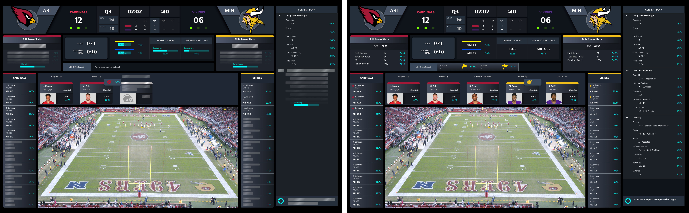

import { getImage, GatsbyImage } from 'gatsby-plugin-image';

Tempus Ex provides a data platform to serve real-time sports analytics, allowing leagues to implement automatic in-game stats and offer play-by-play betting for their fans. The company is currently working with various major sports leagues and the technology is used in stadiums across America. I worked on the first version of the auto stats product that was piloted at Pro Bowl 2020.

  

    <h6>Real-Time</h6>
        
Business Perspective

    
Bring stats reporting into real-time to decrease the time between each play 

  

  

    <h6>Efficiency</h6>
        
Business Perspective

    
Increase operational efficiency of the league by empowering a smaller stats reporting crew

  

  

    <h6>Simplicity</h6>
        
User Perspective

    
Less manual evalation, making it easier to produce accurate results 

  

## Research
#### Understanding pain points of the status quo

At the start, I knew very little about football. “What is GSIS?” I spent the 2 months attending games and exploring GSIS to understand the pain points from the league’s perspective. I made sketches of the user environment and took screenshots of the software in action.

Understanding that our pilot product would be part of a proposal for a larger contract, I then worked closely with management to understand their narrative to ensure that I’d design a product that demonstrates the value propositions they noted.

## Execution
#### Aligning engineering with executives

Then I organized a series of meetings with our team of engineers to learn the sources of data, how we’re ingesting each, layers of inference, and where the computation was taking place. I had a good idea of what we were capable of displaying after the meetings.

My management was keen on nailing the visual feel so I went straight into iterations in high-fidelity.

I created reference documents for the engineers to correlate my intention for the visual activity as certain events are triggered during a game.

## Design Solution
#### A glanceable display console

In the event that a call on a play is contested, a manual override would be performed by an auditor. Currently, the NFL has a replay team on the field re-determining the play. They use apps that a to scrub back, zoom in, and closely examine any video feed necessary to make a more accurate determination. Our auto stats product embeds the functionality of the replay apps. The auditor would make a new determination and the change would propagate up the inference tree.

## Constraints
#### On-time delivery despite the limitations

The 5 weeks leading up to the ProBowl was crunch time. Amid many constraints, the biggest one was the lack of engineering bandwidth. It came time to pare down the design. Not the first time it happened to me at a startup – can’t say I didn’t expect it.

In addition to creating videos for simulated product action, guide documents were also made for the developers to have easy reference to the intended interaction of the product during a live game.

## Client Buy-In

Recognizing that we couldn't build the full product vision in time for the ProBowl, we devised an alternative strategy to secure approval from our client, the NFL. We divided the project into two distinct components:

- A streamlined product version to demonstrate the **essential functional requirements** for a successful ProBowl demonstration.
- A **comprehensive simulation** that showcased the complete vision of the product, utilizing a recording of a previous game.

I personally animated a video to replicate a live game scenario. Additionally, I created a detailed guide to facilitate the NFL's understanding of the console's features and functionality. Below, you'll find a selection of pages from the guide document.

