import { getImage, GatsbyImage } from 'gatsby-plugin-image';

Tempus Ex provides a data platform to serve real-time sports analytics, allowing professional leagues to implement automatic in-game stats, offer play-by-play betting for fans, and implement more efficient internal tools. The TXM Instant Replay provides an improved method enabling replay officials to conduct reviews on play calls in question.

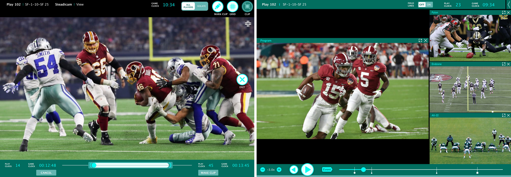

### The Setup

An instant replay during a live football game takes place when there is a close or controversial call. It’s requested either by a team's head coach or one of the referees. A replay review is done by reviewing footage from various cameras. Referees used to review plays in a stationary booth on the side of the field. The process now takes place on wired, hand-held Microsoft Surface tablets on the field. The league also reviews video footage to make determinations on the play in question.

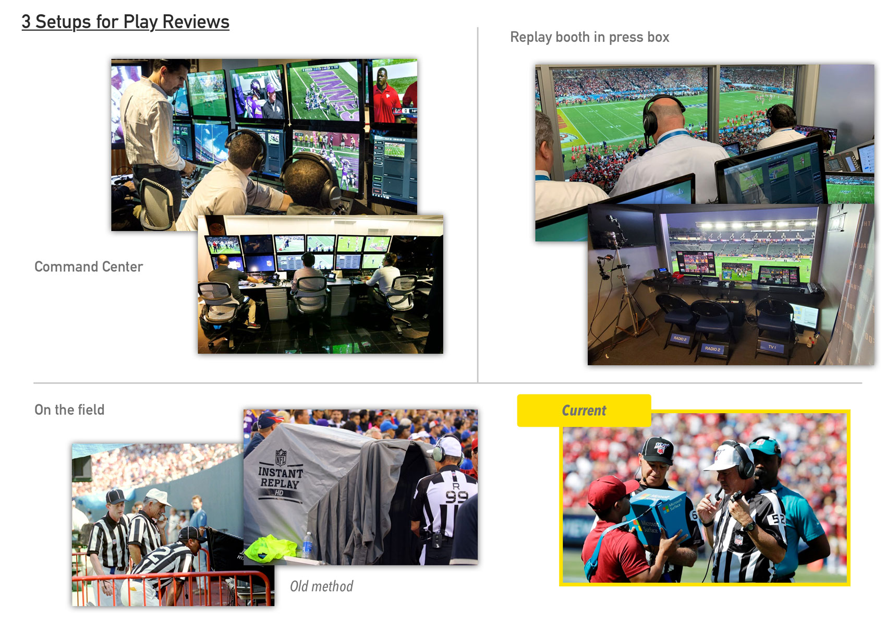

The history of the NFL’s instant replay has always been filled with controversy and modifications that continue to this day. Play reviews delay an already lengthy football game. From 1999 to 2020, only 39% of the plays that required a review were reversed. Some were determined by the league to be incorrectly overturned, making the delay to the games even less warranted.

Our app would initially focus on the NFL referees conducting their review on the field.

  

    <h6>Accuracy</h6>
    
Insufficient tools led to inaccurate determinations after the review process and angry fans 

    
Business Perspective

  

  

    <h6>Engagement</h6>
    
A shorter review process elevated the momentum of a game and drives revenue

    
Business Perspective

  

  

    <h6>Efficiency</h6>
    
Existing tools make the review process time-consuming and cumbersome – referees feel the heat from the fans 

    
Customer Perspective

  

### Research

To get a high-level understanding of the problem, I interviewed internal stakeholders and digested content provided by the NFL. I needed to dig deeper to uncover the root of the issue. Since I was not able to contact any referee of the NFL, I reached out to high school football coaches and referees to conduct interviews. I also studied the features and functionalities of existing replay apps to see how they handled the challenges.

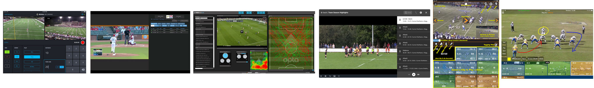

Why is the review process challenging and lengthy?

- There are up to 70 cameras covering a game – that’s a lot of potential footage to review
- The players involved in the call in question is sometimes obstructed
- Refs need to effectively communicate their points of view to each other to come to a consensus
- Identifying the sequence of events is difficult – did he catch first or touch the line first?

I brainstormed potential solutions and sketched them out. I scheduled additional interviews with the high school coaches and referees to talk through my best ones.

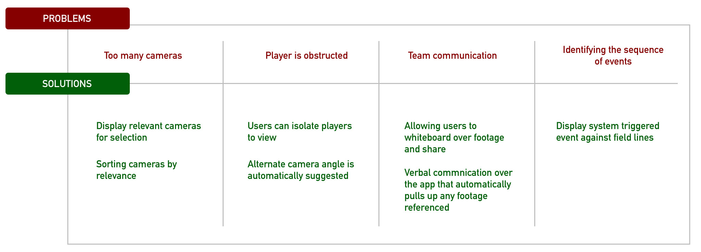

### User Flow Mapping

We narrowed it down to the key features that would best address the challenges. Knowing that we may be releasing the product iteratively, I asked them to rank the importance of each pain point. From there, I mapped out the user task flow.

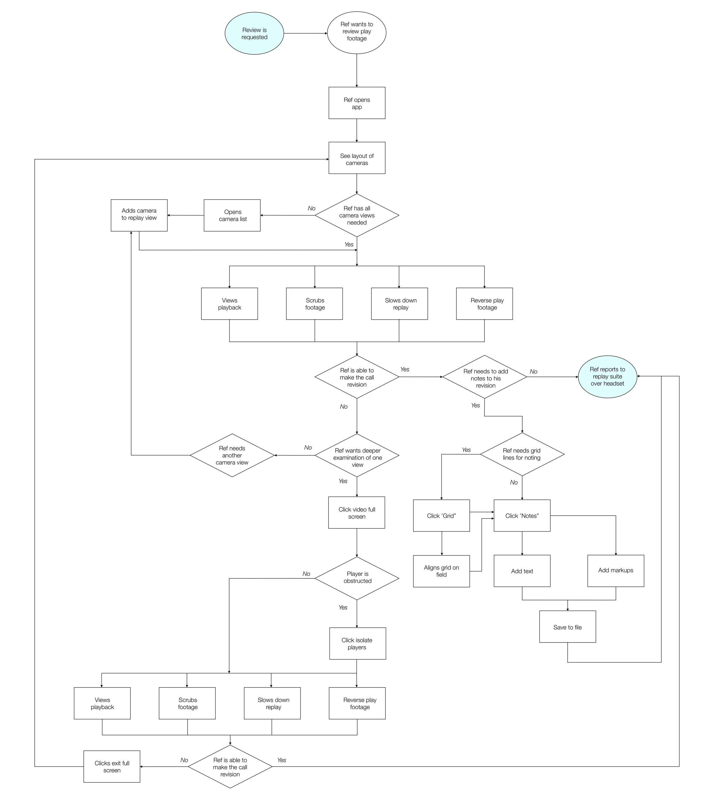

I visualized my ideas in low fidelity and tested them with the referees and coaches.

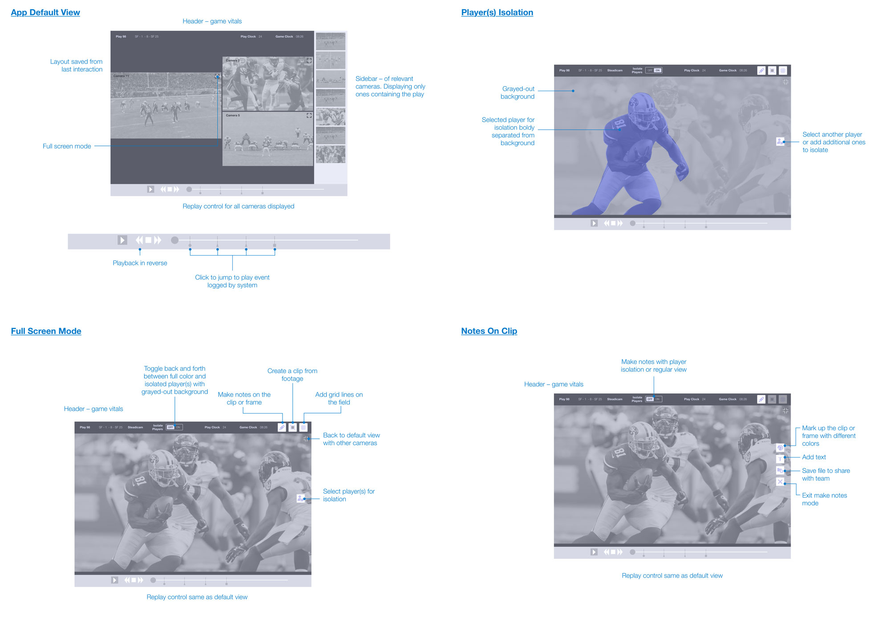

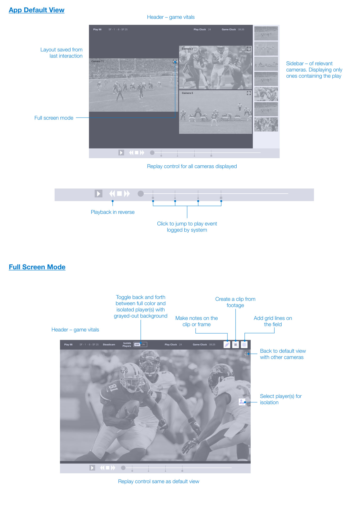

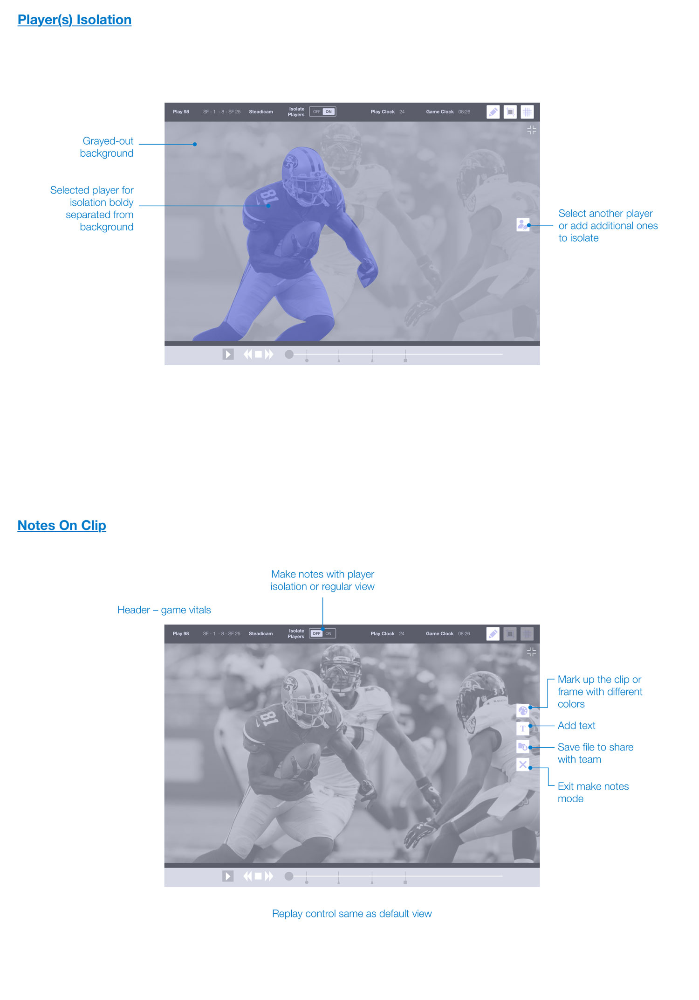

### Final Designs

Referees only have to select from cameras where the play is in clear view. They isolate the key layers by viewing the entire footage with a grayed-out background.

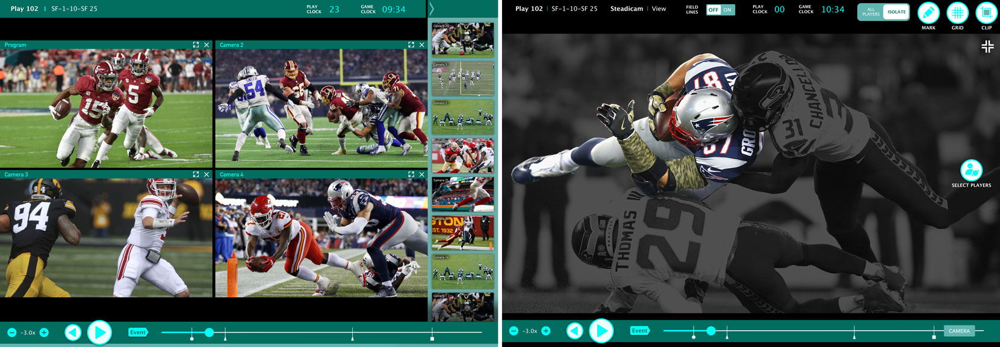

The app displays a flag the moment the system picks up the catch. Now the referee can clearly see that it happened before he touched the bounds.

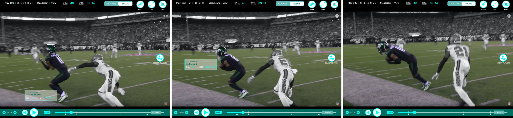

Referees can create their own clips and mark them up with notes.

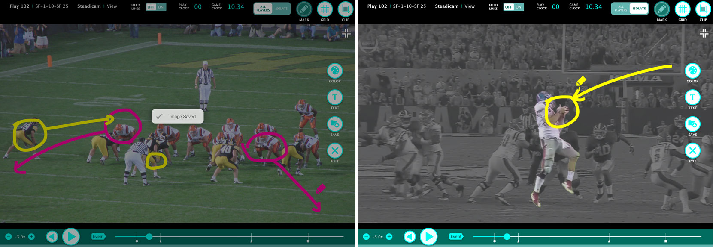

